# Kalos Amie 卡洛斯桌面夥伴

仿《寶可夢 X・Y》「寶可夢交流」的桌面寵物：卡洛斯的寶可夢住在你的桌面上，在整個桌面上到處走、飄在所有視窗之上。
摸摸牠、餵牠泡芙提升好感，點擊桌面上冒出來的「氣息點」遇見野生寶可夢，丟球捕獲、填滿圖鑑。

- 2x 像素風：寶可夢圖是 PokeAPI 的像素圖，其餘（精靈球、泡芙、草叢、表情、介面）都是程式畫的像素美術
- 完全去背、永遠在最上層，滑鼠平常會穿透到下面的視窗，只有停在寶可夢或介面上才會被攔截
- 原創 chiptune 音樂（白天、夜晚、野生遭遇、進化）與音效，全部用 WebAudio 即時合成
- 範圍：卡洛斯新登場的 72 種（No.650 哈力栗 ～ No.721 波爾凱尼恩）

## 開始

需要 Node.js 20 以上。

```bash
npm install
npm start          # 一般啟動
npm run dev        # 開發模式：野生寶可夢每 8–15 秒出現一次、設定裡有「立刻生成」「補滿道具」、系統匣有開發者工具
npm test           # 規則、存檔、形態、視窗偵測、音樂的單元測試
npm run dist       # 打包成安裝檔（Windows: NSIS + portable；在各自的作業系統上打包）
```

沒有螢幕的環境可以做冒煙測試：`KALOS_SMOKE=out.png npx electron .` 會在 8 秒後把透明視窗截圖存到 `out.png` 並結束。
也可以不開 Electron，直接用靜態伺服器打開 `src/renderer/index.html?dev=1`，會自動改用 `mock-api.js`（存檔放在 localStorage）。

瀏覽器端的回歸測試放在 `test/e2e/`（需要另外裝好的 Playwright，不在 `package.json` 裡）：

```bash
node test/e2e/forms.cjs        # 形態圖片（藍花的花蓓蓓真的是藍色的圖）
node test/e2e/anim.cjs         # 會動的像素圖：沒有新顏色（沒糊掉）、大小對、待機呼吸、走路換腳、兩隻不同步、點得到
node test/e2e/puppet.cjs       # 像素木偶（有標骨架的用骨架木偶，照遊戲裡選的；飄著的不檢查待機腳在地上）：72 隻 × 9 組動作都沒有新顏色、有在動、沒被切掉；滑鼠拎起來播「被拎著」；總表 docs/screens/puppet-1～4.png
node test/e2e/kalos-forms.cjs  # 野生花色、圖鑑切換、美容、超級進化（變大後不重疊、不存檔）、牽絆變身
node test/e2e/minigames.cjs    # 五個小遊戲實際玩一遍；每一種結束方式之後，滑鼠都要還給桌面
node test/e2e/perch.cjs        # 站在視窗上：不會被推下去、跟著視窗走、被甩下來、視窗關掉會掉下來
node test/e2e/desktop.cjs      # 番茄鐘、打字反應、孵蛋
node test/e2e/soul.cjs         # 「放著 10 分鐘就有戲」：5 個種子、600 秒快轉（BASELINE=1 看沒有心智時的分布）
node test/e2e/natural.cjs      # 「動得自然」的量尺 M1–M9：12 隻 × 3 個種子 × 10 分鐘快轉，結果寫到 .cache/natural/；M1 瞬間起步（＝0）、M2 腳打滑、M3 走走停停、M4 轉身、M7 像素（整張圖不轉不縮、沒有新顏色、部位角度）、M8 姿勢不跳格、M9 不同步（≤ 不相干配對的 99 百分位）有門檻；M8 每分鐘換狀態 ≤ 每一種自己的上限（每一隻 3 個種子合起來的平均，PR-N5 起有門檻）；練招式、沒有對象的習性一段只做一次（不重新開始，PR-N6）；打斷測試（真的滑鼠拎起來、開選單、放招）；列出表說有腳、木偶切不出腳的
node test/e2e/basecrowd.cjs    # 白天回基地休息不會擠成一團（一次疊在一起最多 3 秒）、有夥伴鑽進帳篷休息；BASECROWD_ROOT=<別的版本> 可以量舊版
node test/e2e/mind.cjs         # 想法泡泡、夥伴資料頁的心智、聊天、一起散步、切磋的記憶
node test/e2e/movefx.cjs       # 招式演出：62 招都放得完、大招周圍變暗、流星群 6 顆都落地、打中會頓一下震一下、減少震動的設定有效、打中只算一次、結束後姿勢回來
node test/e2e/moveprint.cjs    # 每招都不一樣：畫面指紋（只看亮度；被打的那隻不畫：被打的反應每招都一樣，骨架木偶起）跟最像的另一招要差 ≥ 尺 × 2；產生接觸表 docs/screens/moves-<屬性>.png
node test/e2e/cursor.cjs       # 撲游標、追游標、坐在游標旁邊（永遠不蓋住游標、不攔截滑鼠）
node test/e2e/peek.cjs         # 探頭：慢慢靠近會走進來、太快會嚇跑、頻率最多 1/3
node test/e2e/trips.cjs        # 出門旅行：鬼抓人正常結束、走出去、紙條、走回來、收明信片、相簿
node test/e2e/letters.cjs      # 寫信：離開 7 小時信箱立旗子、打開、提到記憶裡的事、惡意暱稱不會被當成 HTML、收件夾、刪信、生日
node test/e2e/story.cjs        # 主線故事：序章選 X／Y、三個人輪流說、廣播變暗、AZ 點了才說話、弗拉達利的信、故事頁重看
node test/e2e/attention.cjs    # 打擾額度：假時鐘模擬 8 小時，任何一小時最多 1 次、沒有繞過額度的通知、排隊的故事最後有打來、專注中不打擾
node test/e2e/phone.cjs        # 手機頁面：設定裡的網址和 QR code、真的小網站開在 127.0.0.1、手機大小的瀏覽器看得到信和明信片、暱稱裡的 HTML 原樣顯示、token 不對打不開
node test/e2e/life.cjs         # 牠們自己的生活：午餐時間手機上寫的跟電腦算的一樣、斷線 30 分鐘照樣過、桌面上自己喝水看書吃東西（不跳通知、不一直重複）
node test/e2e/snap.cjs         # 拍照一起做：真的模型猜杯子、空白照片不預選、改選讀書送出的是讀書、1 秒內手機上一起喝水、桌面上 hover 看得到因果、照片沒有離開手機、CSP 違規 0 次
node test/e2e/offline.cjs      # 斷網也能用：本機 HTTPS 代理假裝 tailscale serve；設定裡測試連線、斷網重新整理還在、斷網拍照排隊、連回來送出（時間是按下去的那一刻）、清掉手機資料從電腦回來、換網址後舊的說網址換了
node test/e2e/us.cjs           # 心情（選單最上面問、很累／很開心／壓力大的效果）、認識滿一週、中秋頭上的月亮、每週日的信
node test/e2e/routine.cjs      # 作息：早上說早安、半夜打哈欠陪你（專注中不會）、專注兩小時慶祝
node test/e2e/battle.cjs       # 道館對戰：館主點了才開打、選夥伴選招式打到贏、徽章與超級手環、上場就超級進化、認輸明天再來、傳說寶可夢抓到才算
node test/e2e/base.cjs         # 秘密基地：空地點不到、家具點得到、擺放和搬動、累了鑽進帳篷（住滿了去床上）、晚上回基地睡
node test/e2e/tent.cjs         # 住進帳篷、換地板：真的點遊樂園地板、帳篷同時最多 2 隻（第 3 隻睡床）、在裡面看不見點不到、會探頭、體力有恢復、睡飽走出來
node test/e2e/world.cjs        # 天氣（不會攔截滑鼠、查不到沿用上次）、獎章、同步資料夾（合併、不重複加）
node test/e2e/habits.cjs    # 72 種寶可夢的每一個習性都能跑完、不會跑出螢幕
node test/e2e/physics.cjs   # 碰撞與擊退：沒有重疊、撞球、重量差
node test/e2e/perf.cjs      # 每幀 update + draw 的時間
```

每個腳本最後一行是 `PASS <名稱>` 或 `FAIL <名稱>: <原因>`。寶可夢圖會快取在 `.cache/sprites`（不進 repo）。

第一次出現的寶可夢圖會從 GitHub 上的 PokeAPI sprites 下載，之後快取在使用者資料夾，離線也能玩。
桌面上的寶可夢維持原本的 **2 倍像素圖**，用程式把它當成「像素木偶」動起來（`src/renderer/gfx/rig.js`）。
卡洛斯的寶可夢每隻只有一張靜止的像素圖（官方會動的像素圖只做到第五代），原圖沒有的姿勢畫不出來，所以是把圖切開各自動：
- **自動切塊**：脖子（上半身最窄的那一列）以上是頭；最下面分成兩段的地方是左右腳；
  輪廓「突出去」的部位（把比較細的地方磨掉，剩下的核心外面、接在核心上的每一塊）是手、尾巴、耳朵、角、翅膀，接在核心的那幾格是關節。72 隻裡有 68 隻找得到。
- **部位會轉**：繞著關節轉，用 RotSprite 的做法（Scale2x 放大 4 倍再最近取樣），轉完像素還是方的；越長的部位轉得越少，才不會一甩就扯開。
- **身體會彎**：一列一列左右錯開（腳站著不動），往前傾、往後仰、扭來扭去。
- **9 組動作**：待機（呼吸、尾巴晃、偶爾抖耳朵）、走（手腳反方向擺）、跑（傾更前面）、開心（兩手舉高、扭）、睡（頭垂、慢慢起伏）、
  吃（頭往前點）、被打到（往後仰）、出招（蓄力再往前撲）、被拎著（腳和手垂著晃）。狀態對應哪一組在 `scene/pet.js` 的 `ANIM_SET`。
- **參數姿勢，姿勢不跳格**：每一組動作是「步相 → 參數」（上身傾幾格、身體沉幾列、頭低幾格、呼吸、左右腳、每種部位的角度），不是固定幾格畫面。
  夥伴身上的參數是連續的，用彈簧慢慢追過去（`gfx/sprites.js` 的 `PuppetView`）：換動作時姿勢是一格一格過去的，每一幀每個參數最多變 1 級；
  手、耳朵、尾巴比身體慢半拍（0.1–0.2 秒），身體往前晃時尾巴會往後甩一下。畫之前才量化（整數格、角度每 3.75° 一級），同一組量化的參數只做一次圖（每張圖快取 256 張）。
- **整張圖不再被縮放、任意旋轉**：行為、習性、招式寫的整張圖姿勢（伸縮、旋轉）由 `scene/pet.js` 的 `toPuppet` 集中翻成木偶的參數：
  小角度的旋轉 → 上身傾斜、壓扁 → 身體下沉、拉長 → 身體伸長、左右伸縮 → 不管；只有跌倒、翻滾、倒立這種接近 90° 的才整張圖轉，而且只轉 90° 的倍數。
  全螢幕時變小也改成整數倍率（每個美術像素 1 個螢幕像素）。
- 野生寶可夢還是用固定幾格的畫面（從同一組參數取樣出來的）。
- 不管怎麼動，每一格的顏色都是原圖有的（不會糊掉、不會出現新顏色）；每一組第一次用到才做，一隻做完全部動作大約 15～55 毫秒。
- 猜的數字：四周留 4 格、多細算突出去（圖短邊的 1/10，2～5 格）、最多 6 塊、關節附近 2.5 格留在身上、比 18 格長的部位按比例少轉、每一組每格的秒數和角度；
  參數姿勢：角度每級 π/48、部位最多轉 0.9 弧度、一秒最多轉 8 弧度、快取 256 張、一隻一秒最多新做 30 張、量化遲滯 0.2 級、
  彈簧快慢（`OMEGA`）、跟隨 0.015、休息時跟隨打 3 折、`toPuppet` 的 rot／sy 換格數（身高 × 0.5）、多近算 90°（0.3 弧度）。
- 效能：6 隻時每幀 update＋draw 平均從約 0.17 ms 變 0.34 ms（多做圖的時間；`perf.cjs` 的門檻是中位數 8 ms、p95 16 ms）。
- **限制**：自動切的不會每隻都完美。像花潔夫人，下半部的葉子會被當成「腳」，走路時葉子會被扯開一點（原本就是這樣，跑步的步幅因此跟走路一樣大）；
  圓圓的、沒有突出部位的（4 隻）只有身體彎和上下動。每一隻切的樣子見 `docs/screens/puppet-1～4.png`。

**骨架木偶（39 隻：試做的呱呱泡蛙 656、甲賀忍蛙 658、布里卡隆 652、小獅獅 667；第 1 批兩腳一般 650 651 654 655 674 677 678 683 685；第 2 批兩腳大隻／爬蟲／恐龍 660 675 694 695 696 697 701 706；第 3 批四腳 653 668 672 673 676 698 699 702 713 716 721；第 4 批翅膀 661 662 663 666 714 715 717）**：自動切的手腳是一整塊硬的，走起來像斷手斷腳。
72 隻全部改骨架的計畫、分批和每一隻要寫的動作卡見 `docs/specs/skeleton-72.md`（9 個 PR，照「怎麼動」分）。
這幾隻改用手標的骨架（`gfx/skeletons.js` 標關節和外框、`gfx/skeleton.js` 動），其他照舊用自動木偶；`gfx/sprites.js` 的 `peekAnim` 照圖片編號選（圖大小跟標的時候不一樣就不用）。
- **關節**：腳是髖 → 膝 → 腳踝 → 腳掌、手是肩 → 肘 → 手腕 → 指尖，每一段繞自己的關節轉；關節附近的像素上下兩段各跟一半（蒙皮），膝蓋、手肘是彎過去的。
- **像素分給哪一段**：從骨頭沿著這條手腳自己的像素往外走（照 Meta AnimatedDrawings），走到畫家畫的深色外框線就停；框裡越過外框線才到得了、又跟身體連著的還給身體。
  框外 1.5 格內、跟手腳連著的也算手腳（框標差一格，外框線不會留在原地）；跟身體主體分開的身體小塊（20 格以內，例：葉子尖）給貼著的那條手腳。
- **手腳底下補身體**：照黑白版畫家把被擋住的地方補畫出來，用規則補：前面的手腳第一段，從身體往裡延伸 3 格、顏色照最近的身體像素，手腳移開才看得到。
- **腳踩在地上**：兩段 IK，膝蓋往原圖彎的那一側；腳踩地時不跟著身體走，抬起來往前擺、腳尖垂。步態照真實動物：兩腳交替、四腳側對步（後左 → 前左 → 後右 → 前右）、青蛙兩腳一起跳。
  踩地占一輪的比例（duty）慢走 0.6–0.65。走的速度照步幅算，動畫照走了多遠推，腳不會滑；跑的時候一步是走路的 1.5 倍（跟 `RUN_STRIDE` 一樣）。
- **身體起伏照動畫的四個姿勢**：著地 → 下沉（最低）→ 交錯 → 抬起（最高）；正面的圖（布里卡隆）身體往撐地的那隻腳偏 1 格。整張圖不再另外彈（腳會離地）。
- **手**：肩膀最多轉 0.35 弧度，再多由手肘彎（長的手整根從肩膀轉太大會扯裂）；走路時跟對側的腳一起前後擺，橫著伸的手幾乎不擺。
- **每一隻照「現實裡最像的動物」動**（`skeletons.js` 每一筆的動作卡）。第 1 批：
  哈力栗＝剛學走的幼兒（短步、手張開保持平衡不擺）、胖胖哈力＝企鵝搖擺（整隻往撐地的腳斜）、長尾火狐＝踮腳走、
  妖火紅狐＝穿長袍（看不到腳，袍子下襬一左一右鼓）、頑皮熊貓＝熊站著走（肩膀痞痞地晃）、妙喵＝小碎步（耳朵摺著不動）、
  超能妙喵＝貓走一直線（小而準的步子）、芳香精＝鴿子點頭（頭先停、身體走過去、頭再往前追）、胖甜妮＝蹦跳步（踏一下＋跳一下）。
  第 2 批：掘地兔＝扛著重物走（耳朵拳頭慢半拍甩）、流氓熊貓＝很重的熊站著走、傘電蜥／光電傘蜥＝傘蜥用兩腳跑（前傾、跑的時候踩地只占 25%）、
  寶寶暴龍／怪顎龍＝獸腳類恐龍像大型地棲鳥（身體水平、小幅點頭、尾巴平衡；大的踩地久）、摔角鷹人＝鷹在地上昂首闊步（翅膀半張）、
  黏美龍＝很重的搖擺步（觸角、捲尾巴慢半拍）。
  第 3 批（四腳，步相照 mammals-locomotion）：火狐狸、火炎獅、坐騎小羊、哲爾尼亞斯＝側對步（後近 → 前近 → 後遠 → 前遠），跑的時候換成奔跑；
  坐騎山羊＝側對步、跑的時候小跑；多麗米亞＝狗小跑（對角兩腳一起）＋點頭；冰雪龍、冰雪巨龍、冰岩怪、波爾凱尼恩＝大象、蜥腳類那種很重的慢走
  （踩地 0.68–0.78，跑也是快走、不騰空）；咚咚鼠＝小老鼠碎步，快的時候兩腳一起的半跳。山羊、狗、鹿、長脖子的走路會點頭。
  第 4 批（翅膀，Animator Notebook〈bird flight〉）：小箭雀＝麻雀在地上跳（小鳥用跳的比走省力，Stanford）；火箭雀＝隼一直拍（一輪 4 下）；
  烈箭鷹、伊裴爾塔爾＝大型猛禽盤旋（拍一下滑一段，待機只小幅晃）；彩粉蝶＝蝴蝶快拍、身體傾斜一直變、一抖一抖（AIP 2025）；嗡蝠、音波龍＝蝙蝠（大的拍得慢）。
- **尾巴、耳朵慢半拍**（follow-the-leader）：`gfx/sprites.js` 的 `PuppetView` 記住根部最近的擺動，第 j 節用 j × 0.07 秒前的，
  習性直接指定的甩法、身體晃帶動的甩都會一節一節傳到尾尖。延遲後的角度也放進快取的 key（同一組參數永遠同一張圖），每節每幀最多變 1 級。
  耳朵、叼著的葉子、頭上的櫻桃接在頭上（點頭、呼吸時一起動）。固定畫面（野生的）沒有延遲。
- 這一批加的動法（`skeletons.js` 的欄位）：`waddle`（搖擺，弧度）、手的 `guard`（保持平衡張開）、`headBob`（點頭，格）、`gait: 'skip'`（蹦跳步）、
  `robe`（腳被袍子蓋住）＋`cloth`（布：照步伐鼓、從根部往下襬慢半拍）。
  第 2 批：`runDuty`（跑的時候踩地比例；步幅跟著縮成 runDuty ÷ duty 倍，一輪走的距離不變、腳不滑）。
  第 3 批：腳的 `runPhase`（跑的時候的步相；走 → 跑之間照走路程度連續換，不會一下跳過去）、`nod`（四腳走路點頭，格）。
  第 4 批：`fly`（飛的：腳收著、步相當拍翅相位，待機也拍）、`flapK`（一輪拍幾下）、`flapAmp`、`glide`（後半滑翔）、`flutter`（蝴蝶一抖一抖）、
  翅膀 `wing`（往下拍占 55%、往下拍時身體被推上去、翅膀尖比根部慢；`wingRest: 'mid'`＝畫成平伸的上下各拍一半）。
  `test/skeletons.test.js` 檢查標記：每一隻都有動作卡、腳至少 3 個點、沒有兩隻的步態組合一模一樣。
- 畫法跟自動木偶一樣是 Scale2x 放大 4 倍再落回格子：像素是方的、不會有新顏色、不會有洞。圖四周多留 10 格（自動木偶 4 格），`scene/pet.js` 算位置、點擊、拎起來時扣掉多的邊。
- 猜的數字：關節位置（看圖一格一格標的）、步幅（腿長 × strideK：甲賀忍蛙 0.14、呱呱泡蛙 0.5、布里卡隆 0.25、小獅獅 0.35）、抬腳高（liftK）、duty、
  起伏（腿長 × 0.06，最低在著地後 0.15 步）、布里卡隆 sway 1、外框線（R+G+B < 150）、框外 1.5 格、補 3 格、小塊 20 格、肩膀 0.35 弧度、關節蒙皮範圍（短的那段 × 0.4，2.5–5 格）、
  走路程度的彈簧（`GAIT_OMEGA` 12）、甲賀忍蛙撐地那隻手轉 0.3 倍、一輪 16 張、走路程度 4 級。
  第 1 批：一節慢 0.07 秒（`LAG_S`）、記 3 節（`LAG_SEGS`）、布一節晚 0.9 弧度（`CLOTH_LAG`）、點頭 hold 占 0.6（`HB_HOLD`）、蹦跳步跳占 0.35（`SKIP_W`）；
  各隻的 strideK（0.12–0.3）、duty（0.55–0.7）、waddle（哈力栗 0.05、頑皮熊貓 0.08、胖胖哈力 0.12）、guard 0.12、芳香精 headBob 2、胖甜妮 skipK 0.4、妖火紅狐下襬 0.08。
  第 2 批：strideK 0.15–0.3、duty 0.5–0.7、傘蜥 runDuty 0.25、恐龍 headBob 1、waddle 0.04–0.07、摔角鷹人 guard 0.06。
  第 3 批：strideK 0.15–0.35、duty 0.55–0.78、runDuty 0.35–0.65、nod 1、奔跑的步相（後近 0、後遠 0.1、前遠 0.5、前近 0.6）。
  第 4 批：往下拍占 0.55（`FLAP_DOWN`）、翅膀一節晚 0.08（`WING_LAG`）、往下拍身體上 1 格（`FLY_BOB`）、flapK 1–4、flapAmp 0.15–0.5、彩粉蝶 flutter 0.08、懸停幅度一半、滑翔 1/4。
- **限制**：甲賀忍蛙蹲著、大腿很大一塊，只能小步走；呱呱泡蛙用跳的。圖只有一個角度，手腳往看的人的方向動看不出來。
  互相推擠（`scene/physics.js`）扣掉多留的邊、跟自動木偶一樣算（第 3 批起；不然有骨架的會把旁邊的推得比較遠，超級蒂安希被推出螢幕）；
  其他的間距、特效位置還是照整張圖（多留的邊）算，有骨架的會寬一點、高一點（最多 6 格）。
  第 1 批：妖火紅狐的袍子轉太大中間會裂，下襬只鼓一點點；胖胖哈力搖最大時右手爪子附近看起來有點亂（整顆球斜 7°，沒有裂）；
  超能妙喵的兩條尾巴畫在一起，只能當一條動；芳香精的點頭只有 1–2 格。
  第 2 批：掘地兔的耳朵拳頭很大塊，甩很大又同時舉手時會裂（平常走路不會）；流氓熊貓的右拳垂到腳邊，步子只能小；
  黏美龍的身體是黏液，但不縮放整張圖，所以沒有果凍晃，只有觸角、尾巴的延遲；光電傘蜥頸部的傘收著不動。
  第 3 批：四腳的圖多半只看得到 3 隻腳（遠的那隻被擋住），就標看得到的；長脖子沒有分節，只有頭會點；
  冰岩怪、波爾凱尼恩沒有頭（臉很小、當身體的一部分）；鹿跑最快時前腳會交疊。
  第 4 批：正面的圖（火箭雀、彩粉蝶、嗡蝠）翅膀往前後的動作看不出來，只有上下；蝴蝶翅膀合起來（clap）做不到（不縮放）；
  翅膀很長的（音波龍）拍太大翅膀尖會揮過臉，只拍 0.15 弧度；小箭雀照遊戲規則不飛，翅膀收著。走最快時（一秒 64 格步相，比 60 幀多）腳會滑一點點。
- 參考過的做法：黑白版官方的木偶動畫（切塊各自轉、被擋住的地方畫家補畫，Oripoke 的教學）、Meta AnimatedDrawings（像素沿著身體分給骨頭、ARAP）、
  The Animator's Survival Kit（走路四個姿勢）、Rain World 的程序動畫（腳黏地、抬腳高度跟步幅成比例）。
- 標新的一隻：`scripts/skeleton/grid.cjs <編號>`（原圖放大加格線，照著標關節）→ 寫進 `skeletons.js` → `scripts/skeleton/skelshot.cjs`（骨架疊在原圖上＋走一輪的總表，
  `docs/screens/skeleton-walk.png`、第 1 批 `skeleton-biped.png`、第 2 批 `skeleton-big-biped.png`、第 3 批 `skeleton-quad.png`、第 4 批 `skeleton-wings.png`）、`one.cjs`（指定參數放大看一張）、`walkvid.cjs`（新舊並排走路影片）。都要先有 `.cache/sprites/<編號>.png`（跑過 e2e 就有）和 Playwright。
每一隻的節奏不同步。
下載失敗時會先用依屬性顏色產生的替代圖。

## 怎麼玩

| 動作 | 做法 |
|---|---|
| 撫摸 | 游標在寶可夢身上**來回**滑動（不用按滑鼠）。滿足感滿了之後，好感度就不再因為撫摸增加 |
| 餵泡芙 | 點寶可夢 →「餵泡芙」→ 選泡芙 → 把泡芙拿到牠嘴邊。吃太飽會拒絕 |
| 抓起來 | 按住寶可夢拖曳到桌面任何地方，放開會掉下來、甩出去會滑一段（甩太用力會暈） |
| 遇見野生寶可夢 | 桌面上出現草叢、水窪、石頭、鬼火，或天空有影子掠過時，點一下 |
| 捕獲 | 在遭遇列選一顆球，瞄準圈縮到最小時點寶可夢。先給泡芙會提高捕獲率、降低逃跑率 |
| 選單 | 右下角的精靈球，或系統匣圖示 |

### 好感度（寶可夢交流）

三個條都是 0–255，跟原作一樣：**好感**（換算成 0–5 顆心，門檻 1/50/100/150/255）、**飽足感**、**滿足感**。
飽足感每 2 分鐘 −1、滿足感每 1 分鐘 −1；好感不會下降。離線期間最多補算 24 小時。
每隻寶可夢有性格（25 種），性格決定喜歡與討厭的口味，吃過一次喜歡／討厭的口味後就會顯示在夥伴資料裡。

| 泡芙口味 | 對應味道 | 當誘餌時吸引的屬性 |
|---|---|---|
| 甜甜 | 甜 | 妖精、一般 |
| 薄荷 | 澀 | 草、水、冰 |
| 柑橘 | 酸 | 電、蟲、飛行 |
| 摩卡 | 苦 | 惡、幽靈、超能力、岩石、鋼、地面 |
| 辛辣 | 辣 | 火、格鬥、龍、毒 |

好感 ♥3 以上會跟著游標走、你離開電腦回來時跑過來迎接；♥2 以上偶爾會撿泡芙送你。

### 夥伴的動作

桌面被當成一片從上往下看的地板，夥伴會在整個桌面上走動（不是只走在工作列上），越下面的畫在越前面，腳下有影子。
會自己做的事：散步、發呆、東張西望、坐下、伸懶腰、發抖、暴衝亂跑、跌倒、轉圈、打滾、
聽到音樂會跳舞（沒靜音時）、走到其他夥伴旁邊打招呼、兩隻追著玩、半夜或你離開很久時睡覺（醒來會伸懶腰）。
好感越高，會做的花樣越多；膽小（♥0–1）的在游標突然衝過來時會嚇一跳。

**每一種怎麼過日子：物種生活表**（`src/core/ethogram.js`）

以前所有寶可夢共用一張權重表：花、老鷹、蛞蝓都是每 4 秒換一件事、時間分配一樣。
現在「下一件事做什麼、做多久」由物種生活表決定（`nextBout()`），`Pet.decide()` 只負責照著做。
- 72 隻各有：身體（體型分類）、作息（晝行／夜行／晨昏）、個性、時間分配模板、睡姿、習性、招牌動作。
  每一隻怎麼判斷的都寫在 `why`：**外型**、**屬性**、**圖鑑＋52poke 寶可夢百科**（出處網址；百科是 CC BY-NC-SA，只放自己寫的一兩句話）。
- 時間分配照最像的真實動物：例如火炎獅（獅子）大部分時間在休息、坐騎山羊（羊）花很多時間吃草、小箭雀（鳥）常整理羽毛。
  挑下一件事時，機率 ∝ 時間分配 × 心智的需求 ÷ 這一類平均一段多長，所以「花的時間」照表，不是「次數」照表。
- 休息是大宗，一段可以很長（多數短、少數很長）；動物大多回窩休息，所以休息時比較常回秘密基地。
- 不是牠的時段（例如夜行的嗡蝠在白天），醒著做事的時間 × 0.4。
- 屬性對環境：火屬性下雨躲、水屬性下雨出來玩、電屬性插電更常放電、冰屬性午後怕熱、格鬥早上練習、幽靈晚上活躍、飛行待在高處…
- 外型對動作：四腳的常聞、常伸懶腰；兩腳的常走動；有翅膀的常展翅；一團的少走動；球形的會滾。
- 表裡寫「最常」「常常」「一直」的動作是招牌動作（例如呱頭蛙最常爬上視窗、妙喵常常呆望），同一類裡比較常被選到。
- 專注番茄鐘、晚上回基地、累壞了回床上睡這些優先規則照舊，先跑。

**一件事做多久：節奏**（PR-N4b）
- 做完一件事就直接接下一件，不再每次先停 1–3 秒（以前每件事都多換一次狀態）。從球裡出來、跳上視窗站穩的那一下照樣停。
- 噴水、火花、打滾這些 1–2 秒的小動作，在一段時間裡重複做（動物玩一段＝同一個動作做好幾次），做滿這一段才換別的事。
- 東張西望、找吃的、伸懶腰、抖一抖、暴衝的一段都拉長了（時間分配不變：挑的機率 ∝ 時間 ÷ 長度）。
- 遊行、合照、切磋、追完這些互動結束時的開心：彈一下、舉手，不另外切一個狀態。
- （PR-N5）休息中（坐著、發呆、曬太陽、看書…，睡著的不算）被旁邊的吼叫、超音波、放招嚇到或冷到：彈一下、頭上冒表情，接著休息，不打斷（以前每次都打斷休息再挑下一件事）。
- 正在休息的前 80%，別隻不會找牠去玩（有人探頭、日落這些還是會抬頭看）。
- 每分鐘換事的上限每一種不一樣：4 + 6 ×（醒著做事的比例），休息多的越安靜（`switchMaxAt`；哈力栗 7、坐騎山羊 8、火炎獅 5）。
- （PR-N5）一段多長也照同一個模板：休息越多的物種節奏越慢，每一段乘上 `tempoAt`（休息 0% 時 1 倍、一半約 1.7 倍、八成約 2.7 倍）。
  散步走滿這一段（路線走完就換個方向接著走）、找吃的做滿這一段。
- （PR-N6）**自己練招式、沒有對象的習性只做一次**，這一段剩下的時間安靜待著（待機：呼吸、尾巴晃），時間到了才挑下一件事；剩不到 1 秒（`QUIET_MIN`，猜的）就直接挑。
  以前一段裡連放好幾招、同一個習性一直重複，使用者說像在打空氣、不自然。上面那些 1–2 秒的小動作照舊重複。
  代價：每分鐘換事的次數變多（做完 → 待著 → 下一件多換一次），量過都還在每一種的上限內，但有的很接近（花潔夫人 5.7／6、哲爾尼亞斯 4.8／5）。
  `natural.cjs` 會檢查只做一次的在一段裡沒有重新開始。
  休息、東張西望、找吃的、伸懶腰、抖一抖的表的長度也再拉長（舊值寫在 `core/ethogram.js` 的註解）。習性自己比較長的，挑的時候照它自己的長度算時間分配。

猜的數字（全部在 `core/ethogram.js` 標了「猜的，可調整」）：12 種模板的百分比、習性占 8%、不是牠的時段 × 0.4、
每種動作一段多長、屬性對環境的倍率、外型對動作的倍率、招牌動作 × 2、回窩休息 × 3、跳上視窗的權重（對著舊版量的次數校正）。

限制：
- 理毛還沒有真的動作，只有伸懶腰、抖一抖，所以理毛的時間先算進休息（`GROOM_ACTS`）。
- 每分鐘換狀態的次數同一隻每 10 分鐘差很多（量過同一隻 0.9–5.8），門檻看 30 分鐘的平均；被別隻叫去玩、被嚇到這些不照節奏，算在裡面。
- 12 隻一起放、中午以外的時段沒有量過。

**怎麼移動**（`src/renderer/scene/locomotion.js`；`Pet.moveTo()` 全部交給它，120 幾個地方不用改）

- 加速、減速有上限（依身體：`core/ethogram.js` 的 `GAIT`，重的起步慢），快到目的地時照煞車距離慢下來，不會一頭撞到才停。
  上限只看身體（照跑步起步算），不看這次要走多快：衝過去不會起步得比跑步還猛，慢慢走時也煞得住。
- 先轉身再走：要往背後走時，先停下來轉（0.14–0.25 秒，依身體），轉身時往新方向偏一格當預備動作；
  目標在背後要持續 0.12 秒才轉，不會在目標附近左右抖。轉圈、跳舞這種本來就要快速翻的照舊。
- 腳不打滑：走路時腳跨的格數照腳長（2–3 格），走路、跑步的動畫照「走了多遠」播，不是照時間；
  步頻有上限（走一秒 4 輪、跑 6 輪，跑的時候有騰空、一步多走 1.5 倍），所以腳短的是小碎步、走得慢一點。
- 散步是 2–3 段微彎的路線（相關隨機漫步），走 0.8–2 秒就停下來看一看（真的站住以後 0.5–1.8 秒，煞車不算），像小動物那樣走走停停；
  有目的地的走路（去吃、去基地、去你旁邊）不停。
- 走路會繞開擋在前面的夥伴；靠近螢幕邊緣會先慢下來。被打斷（被叫去看東西）時滑一小段停下，不會瞬間停住。
- 螢幕邊是「軟邊」：自己走、滑過去的可以超出 3 格，照減速度停下，不會像撞牆一樣瞬間停住；要去的地方先夾進自己能站的範圍（會飄的比較小）。
  頭上留 14 格，嚇一跳往上跳也不會碰到螢幕上緣被往下推。
- 打滾有加減速：往空間大的那邊滾，快到邊先慢下來再彈回來。回床上睡覺會走到床邊才躺下，不會瞬移過去。
- 在基地休息會保持距離：挑沒人的空格、跟別隻疊在一起就讓後來的挪開；白天一半的機會鑽進帳篷休息。

猜的數字（都在程式裡標了「猜的，可調整」）：`GAIT` 的加速、轉身時間和速度倍率、步頻上限、跑步騰空 1.5 倍、
每步 2–3 格、翻面遲滯 0.12 秒、散步的段數和長度、停頓的間隔和長度、繞開的距離、基地擠不擠的比例（25%／15%）、
軟邊 3 格、頭上留 14 格。

**心智：牠為什麼這樣做**（`src/core/mind.js`、`src/core/memory.js`）

每一隻都有 6 種需求：肚子、體力、想找人玩、開心、好奇心、舒適。需求會隨時間下降，做了對應的事就會回升。
- 個性由性格決定，一共有 5 種特質：外向、好奇、貪吃、愛睡、膽小。例如爽朗的比較愛找人玩，害羞的比較少。
- 缺什麼就比較想做什麼。同一種事連續做 3 次會做膩，就會換別的事做。
- 肚子餓了會自己去附近找樹果，但只夠不餓，吃不飽。很餓的時候會跟你討泡芙。
- 休息時旁邊有好朋友（感情 60 以上）或剛一起玩過的（30 分鐘內、160 格以內），理由會提到牠：「想待在哈力栗旁邊休息」「剛剛跟火狐狸玩得好累，休息一下」。

**想法泡泡**
- 滑鼠停在寶可夢身上 0.6 秒，頭上會出現牠現在的想法，例如「好睏…先休息一下」「想找好朋友哈力栗玩」「上次輸給呆火狐，這次不會輸」。
- 理由是在決定做什麼「之後」才想的，所以一定跟牠實際在做的事對得上。
- 泡泡跟名字標籤是同一個框，一起移動；寶可夢在螢幕最上面（例如站在視窗上）時，會改到腳下顯示。
- 聊天時冒出來的表情有白色的小對話框，尾巴指著頭；兩隻站得很近時對話框會往外側偏，不會疊在一起。

**記憶**
- 會記得的事：你餵牠吃了什麼、摸牠、跟誰玩、切磋贏或輸給誰、有新朋友來了、你離開了幾個小時。
- 每隻最多記 40 件事，越舊、越不重要的越先忘記。

**夥伴資料頁**：可以看到心情、需求、最近在想什麼，以及牠記得的事。

**夥伴之間**
- 兩隻會停下來聊天，冒出的表情看各自的心情。
- 感情好的會並肩一起散步。
- 切磋會分出輸贏：輸的會坐下來，而且會記住輸給誰，競爭心 +1。

心智不會自己選行為：下一件事由物種生活表的 `nextBout()` 決定，心智只是把每一類的權重乘上倍率（0.25–4）。
驗收用的是 `test/e2e/soul.cjs`，條件如下：
- 3 隻寶可夢，完全不操作，放 600 秒（快轉）。
- 至少要出現 6 種不同類別的行為，沒有一種超過 40%。
- 每個決定都要有理由，而且理由要屬於實際做的那一類。
- 每個種子至少 2 個理由提到需求；提到關係或記憶的理由，5 個種子合起來至少 5 個
  （骨架木偶第 3 批改的量法：原本每個種子都要至少 1 個，但放 10 分鐘有沒有提到關係很看路線，main 上 12 個種子裡本來就有 1 個是 0）。
- 用 5 個種子各跑一次，5 次都要通過。

**滑鼠變成玩具**（`src/renderer/scene/cursor.js`；你在用電腦時才會玩）
- 游標在附近快速晃動：牠會壓低身體，然後撲過去。
- 追著游標跑，一跳一跳的。
- 游標停超過 8 秒：牠會走過去坐在游標旁邊。游標一動，牠就嚇一跳跑開，而且會記得。
- 好奇、外向的比較愛玩；膽小的比較少玩。
- 牠們永遠停在游標「旁邊」，不會蓋住游標。所以不會擋到你點底下的視窗。

**野生寶可夢探頭**
- 有時候野生寶可夢不是從草叢跳出來，而是從螢幕左邊或右邊的邊緣露出半個身體。
- 游標慢慢靠近、停在牠旁邊 1.5 秒，牠就會走進桌面，接著跟平常一樣可以捕捉。
- 游標衝太快，牠會縮回去跑掉。這時還沒開始遭遇，所以不會中斷連鎖。
- 離牠最近的夥伴會注意到：想法泡泡會顯示「外面好像有誰在看？」。
- 探頭跟一般的出現共用同一個計時，所以野生寶可夢不會變多。每 3 次出現最多 1 次是探頭。

**出門旅行**（`src/core/trips.js`、`src/renderer/scene/travel.js`）
- 好奇或無聊的夥伴，有時候會自己走到螢幕邊緣，揮揮手，然後走出去旅行。你也可以在夥伴頁按「讓牠去旅行」。
- 同時最多 1 隻在外面，桌面上至少會留 1 隻。
- 牠出發的地方會留一張紙條，點紙條可以看到牠去了哪裡、大約幾點回來。
- 旅行 30 分鐘到 6 小時，越好奇去越久。用真實時間計算，所以程式關掉也照樣在旅行。
- 回來時從螢幕邊緣走進來，頭上頂著明信片。點牠就能收下：
  - 一張明信片，是 12 個卡洛斯地點之一的像素風景。
  - 一句日記，有時候會提到牠的好朋友。
  - 禮物：樹果、精靈球或泡芙。偶爾會撿到蛋，偶爾會帶一個野生的朋友回來。
- 選單裡的「相簿」可以看到所有收過的明信片，以及還沒去過的地方。
- 新增 3 個獎章：第一次出遠門、去過 6 個地方、12 個地方全部去過。
- 結算用的是旅行自己的種子，所以結算幾次結果都一樣。
- 兩台電腦同步時，在哪一台收下明信片，禮物就只會算一次。
- 電腦時鐘被調回去，牠一樣回得來。

**秘密基地**（`src/core/base.js`、`src/renderer/scene/base.js`、`scene/home.js`）
- 螢幕左下角（也可以改成右下角）有一塊小院子。後面是住的地方，前面的格子可以擺家具。
- 住的地方會升級：帳篷 → 小屋 → 樹屋。
- 升級和家具要用材料：木頭、布、石頭、閃亮石，都是夥伴旅行帶回來的。
- 家具有床、桌子、地毯、燈、盆栽、獎盃。獎盃不用材料，但有幾個獎章才能擺幾個。收起來的家具會把材料全部還你。
- 一開始就有帳篷和一張小床。
- 寶可夢會自己用基地：
  - 累了會**鑽進住的地方睡**：走到門口鑽進去，就看不見、也點不到了；偶爾會從門口探頭看看外面；睡飽了自己走出來、伸個懶腰（晚上鑽進去的睡到早上才出來，跟睡床一樣）。
    帳篷住得下 2 隻、小屋 3 隻、樹屋 4 隻，住不下的就回床上睡（一張床睡一隻）。累壞了（體力低於 20）會直接回家睡。
  - 想休息會回院子坐坐。
  - 晚上大家都會回基地：住的地方有位子就鑽進去，床空著就上床，不然就跟在睡的夥伴擠在一起。
- **地板**：院子可以換成沙地或遊樂園（粉紅、淺藍、奶黃的格子磚和小星星），在「秘密基地」裡點一下就換，不用材料。

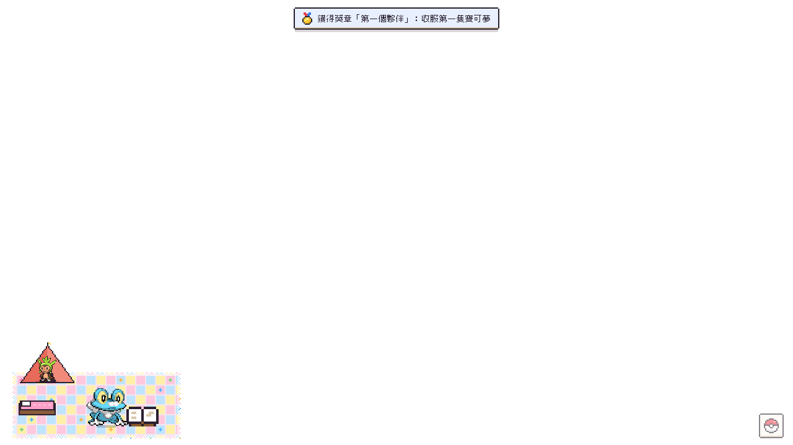
- 選單的「秘密基地」可以升級、擺家具、搬動、收起來，也可以換位置和地板。
  - 擺放時會出現格線，放得下的格子是綠色、放不下的是紅色。按右鍵取消。
  - 直接點桌面上的家具也可以搬動它。
- 滑鼠：只有家具點得到。院子的空地和帳篷都點不到，所以不會擋到你點後面的視窗。
- 兩台電腦同步時，基地用最後修改的那一邊。材料放在背包裡，跟其他東西一樣走 ledger。

**寫信給你**（`src/core/letters.js`；全部在本機用範本組出來，不連網、不用 AI）
- 夥伴會在這些時候寫信給你：
  - 你離開超過 6 小時：「你不在的時候…」
  - 旅行回來的隔天早上 9 點。
  - 好感滿了。
  - 你的生日，可以在設定裡填，不填也沒關係。
- 秘密基地旁邊有一個小信箱。有沒看的信時紅旗子會立起來（兩封以上旗子旁邊有數字），點信箱就會打開最舊的那封。
- 沒有新信的時候點信箱（或選單的「信箱」）打開收件夾：可以重讀、刪除。刪掉的信在同步的另一台電腦上也不會跑回來。
- 每天最多 2 封，沒寄完的隔天再寄。
- 一封信由幾段組成：
  - 開頭。
  - 為什麼寫信。
  - 牠記憶裡真的發生過的 1–2 件事，例如你餵了什麼、跟誰玩、輸給誰、去了哪裡。不會編造沒發生的事。
  - 提到好朋友或競爭對手。
  - 現在的心情。
  - 結尾，最後有牠的屬性顏色的小腳印簽名。
- 語氣看個性：外向的很熱情，膽小的很害羞，貪吃的一定會提到吃的。
- 最近 5 封用過的開頭和結尾不會再用。
- 信的內容一律當成純文字顯示，就算暱稱取成 HTML 也不會被執行。

**生態動作**（依屬性與時間，寫在 `src/renderer/scene/behaviors.js`）：

| 誰 | 會做什麼 |
|---|---|
| 草、火 | 白天曬太陽 |
| 水 | 原地踩水花 |
| 火 | 噴小火花 |
| 電 | 身上劈啪作響；剛接上電源時特別有精神 |
| 冰 | 身邊飄雪 |
| 毒 | 吐泡泡 |
| 幽靈 | 淡出、偷偷換位置（晚上更常） |
| 超能力 | 瞬間移動 |
| 地面、掘掘兔系列 | 鑽進地下、從別的地方冒出來 |
| 岩石、鋼 | 身上閃閃發亮 |
| 蟲、一般、草 | 低頭找東西吃 |
| 格鬥 | 打空拳練習 |
| 妖精 | 轉圈灑亮粉 |
| 黏黏寶系列 | 慢慢爬、留下黏液 |
| 會飛的 | 拉高滑翔到遠處 |
| 作息 | 白天活動的晚上會打瞌睡，嗡蝠與幽靈、惡屬性白天比較會打瞌睡 |
| 誘餌泡芙 | 桌面上有誘餌時，肚子餓的會跑過去聞 |

**夥伴之間的互動**：打招呼、追著玩、互丟精靈球、玩打架、用屬性招式逗對方
（水槍噴火屬性會生氣、澆草屬性會開心、電一下會暈、妖精的光會冒愛心、超能力會把對方抬起來）、
惡和幽靈屬性從背後偷偷靠近嚇人、同一條進化線的小的跟在大的後面走、同一種一起跳舞、晚上擠在一起睡（喜歡靠著火屬性的）、
看別人吃泡芙、野生寶可夢出現時一起看過去、抓到時一起歡呼。

**每一種的專屬習性**（根據圖鑑敘述與原作設定，寫在 `src/renderer/scene/habits.js`，夥伴資料和圖鑑裡看得到）：

650–721 的習性（PR-N4b、PR-N5）改成「身體做的事」：用像素木偶的姿勢（蹲低、前傾、低頭、舉手、耳朵往後貼、尾巴翹高）和移動來演，特效只當點綴；
每一種上面寫了真實參考（例如哈力栗縮起來＝犰狳、刺蝟受驚；烈箭鷹俯衝＝游隼 stoop：先蹲低起飛、收起翅膀往前傾衝下去；
坐騎山羊吃草＝低頭一小步一小步往前嚼；槍蝦射水＝鉗子舉起瞄準、射出時被後座力推一下；寶寶暴龍耍賴＝左右腳輪流跺；黏黏寶縮起來＝蝸牛觸角縮回、身體變扁）。
以前整張圖左右移、轉、壓扁拉長的（`pose`）全部改成身體姿勢（`puppet`）。一段 1.3–25 秒，比以前長。俯衝、跳最快跟跑步一樣，加速度有上限；甲賀忍蛙的忍術、胡帕鑽圓環是瞬移（不算瞬間起步）。
還沒做（要先問）：鑰圈兒真的把東西帶回去、朽木妖讓小的夥伴站在頭上、胡帕用圓環把東西藏起來。

| 寶可夢 | 習性 |
|---|---|
| 哈力栗系列 | 縮進硬殼、跟夥伴互相衝撞鍛鍊、布里卡隆舉拳防禦 |
| 火狐狸系列 | 咬著樹枝散步、耳朵噴熱氣、點燃樹枝向同伴打信號、妖火紅狐的火焰漩渦 |
| 呱呱泡蛙系列 | 泡泡包住全身並留意四周、呱頭蛙跳得老高、甲賀忍蛙消失再出現、丟水手裏劍 |
| 掘掘兔系列 | 有會飛的夥伴時一聽到動靜就挖洞躲起來、掘地兔掉保暖的毛 |
| 小箭雀系列 | 啄地、興奮就發燙、火箭雀趕走靠近地盤的、烈箭鷹高速俯衝 |
| 粉蝶蟲系列 | 噴粉末、粉蝶蛹變硬、彩粉蝶灑下彩色鱗粉 |
| 小獅獅系列 | 好奇地跑去看別的東西、鬃毛發熱、火炎獅大吼讓大家嚇一跳 |
| 花蓓蓓系列 | 收集花粉、種花照顧花、花潔夫人在身邊種出一圈花 |
| 坐騎小羊系列 | 吃草、坐騎山羊用角互撞 |
| 頑皮熊貓系列 | 努力瞪人但忍不住笑出來、流氓熊貓咬著葉子感覺動靜 |
| 多麗米亞 | 整理毛、游標靠近時撒嬌 |
| 妙喵系列 | 超能力不小心爆發把旁邊的彈開、超能妙喵張開保護罩保護好朋友 |
| 獨劍鞘系列 | 搖晃、吸一點夥伴的精氣（對方會想睡）、雙劍鞘快速揮劍、堅盾劍怪切換架勢 |
| 粉香香、綿綿泡芙系列 | 香氣吸引夥伴過來、芳香讓大家放鬆、吐絲黏住夥伴、胖甜妮軟綿綿地彈跳、聞到誘餌就衝過去 |
| 好啦魷系列 | 閃光讓大家頭暈再溜走、烏賊王催眠夥伴讓牠慢慢走過來 |
| 龜腳腳系列 | 兩個頭吵架、龜足巨鎧用手上的眼睛看四周 |
| 垃垃藻系列 | 假裝成海藻、毒藻龍讓頭頂曬太陽 |
| 鐵臂槍蝦系列 | 從鉗子射出水彈，鋼炮臂蝦的更遠更猛 |
| 傘電蜥系列 | 白天曬太陽發電 |
| 寶寶暴龍系列 | 任性跺腳撒嬌、鬧著玩地咬夥伴、怪顎龍重踏地面 |
| 冰雪龍系列 | 帆上閃著極光（晚上更常）、冰雪巨龍的鑽石塵 |
| 仙子伊布 | 用緞帶安撫頭暈或不開心的夥伴 |
| 摔角鷹人 | 出招前擺華麗姿勢（有時被打斷跌倒） |
| 咚咚鼠 | 從電屬性夥伴那裡偷電、電腦剛接上電源時去充電 |
| 小碎鑽 | 靜靜地沉睡 |
| 黏黏寶系列 | 有東西靠近就縮起來、黏美兒聞到誘餌就衝過去、黏美龍黏答答地抱住好朋友 |
| 鑰圈兒 | 搖鑰匙、到處找亮晶晶的東西 |
| 小木靈系列 | 用小孩的聲音把夥伴引走（對方會迷路）、朽木妖伸出根鬚 |
| 南瓜精系列 | 南瓜夜裡發光、南瓜精催眠夥伴、南瓜怪人晚上跑去「敲門」（選單按鈕） |
| 冰寶、冰岩怪 | 冰寶凍在冰岩怪背上一起移動、冰岩怪晚上坐著讓裂縫長好 |
| 嗡蝠系列 | 發出超音波，大家摀住耳朵 |
| 傳說、幻之寶可夢 | 哲爾尼亞斯分享生命能量、伊裴爾塔爾張開暗色翅膀、基格爾德的核心繞圈、蒂安希做出鑽石、胡帕鑽進圓環、波爾凱尼恩噴蒸氣 |

**大家一起玩**（寫在 `src/renderer/scene/social.js`）：鬼抓人（當鬼的頭上有 💢，碰到就換人）、排隊遊行（有音樂時更常）、
捉迷藏（鬼蹲著數數，其他的跑去躲起來變半透明）、大家排成一排合照；
好朋友之間會蹭蹭、瞪眼比賽、叼泡芙給肚子餓的夥伴（只是動作，不會用掉背包裡的泡芙）、
感情很好又體型差很多時小的會騎到大的背上；有夥伴跌倒或頭暈時，感情好的會跑過去安慰。

互動會累積**夥伴之間的感情**（認識了 → 好朋友 → 最好的朋友），感情越好越常一起玩；夥伴資料裡會顯示牠跟誰最要好。

### 主線故事（X・Y）

X・Y 的主線節點，改成發生在你的桌面上（`src/core/story.js`）。**完全照真實時間**：從序章那天算起，第幾天就發生第幾天的事，不用達成條件。
電腦沒開的日子錯過的事，下次打開時一件一件補上（兩件之間至少隔 10 分鐘）。專注中、勿擾模式、玩小遊戲、遇到野生寶可夢的時候不會打斷你。

- **全息投影通訊器**：故事裡的人打來時，左上角出現藍色的投影，一句一句打字出來；點一下繼續。廣播會出現在桌面正中間，周圍變暗，夥伴會轉頭看
- **序章**（第 0 天）：布拉塔諾博士打來。他問的問題決定你走 X 還是 Y（之後遇到的傳說寶可夢不一樣）
- 第 1 天：莎娜、蒂艾爾諾、特雷維輪流打來；第 5 天：弗拉達利的奇怪廣播；第 9 天：一個很高的旅人站在秘密基地旁邊（點他才會說話）；第 11 天：弗拉達利寄來一封信
- **道館**（第 12～36 天，大約兩天一個）：8 位館主輪流來到秘密基地旁邊，點他說完話就在桌面下方中間**真的打一場**（見下面「對戰」）。贏了拿徽章，輸了明天再來
- **超級進化**：第 16 天可爾妮送你**超級手環**（和摔角鷹人進化石），隔天博士寄來你的御三家那一族的進化石。之後館主、四天王、特別事件會再送其他的進化石（見下面「形態」的表）
- **閃焰隊**：手下來搶你的寶可夢、弗拉達利的電話和「終極武器」廣播；第 31 天打贏閃焰隊的首領後，隔天**你那個版本的傳說寶可夢**（X：哲爾尼亞斯、Y：伊裴爾塔爾）出現在桌面上。牠不會逃走、不會自己走掉，而且比較好抓；抓到才算這件事做完（關掉 app 下次打開會再出現）
- **寶可夢聯盟**（第 38～42 天）：四天王一天一位，最後是冠軍卡露乃（三隻）。第 43 天是 AZ 的結局
- **特別事件**：不照日子排隊，條件到了才發生。破關後朋友們送你另外兩族御三家的進化石；國際刑警「帥哥」只在晚上來（烏賊王進化石）；**另一隻傳說寶可夢**在破關幾天後、特定的時段出現（X 版是晚上的伊裴爾塔爾、Y 版是早上的哲爾尼亞斯）；還有關於基格爾德的線索
- 選單的「故事」：第幾天、下一件事大約幾天後（不劇透是什麼事）、8 個徽章，以及發生過的事，可以重看
- 對話都是重新寫的，沒有照抄遊戲台詞
- 人物的圖用 Pokémon Showdown 的訓練家圖（第一次需要時下載、存在使用者資料夾）；Showdown 拿不到時改從 Smogon 在 GitHub 上的原始檔（[smogon/sprites](https://github.com/smogon/sprites)）下載。都拿不到（例如沒有網路）的時候用剪影

**對戰**（`src/core/battle.js`、`src/renderer/scene/battle.js`）：桌面上的夥伴都可以上場，一次一隻；畫面下方的面板選招式（會顯示「效果絕佳」之類的提示），招式特效跟切磋一樣。
規則刻意簡單：每隻 100 HP、你先攻，傷害看屬性相剋、本系加成、進化到哪裡、好感和超級特訓。
好感的效果照原作的寶可夢親善：越親近越容易擊中要害、會為了你躲開攻擊、快倒下時撐住一次。
有進化石＋超級手環的夥伴，一上場就超級進化（一場一隻）。可以換夥伴（用掉一回合）或認輸。
輸了明天再來，而且每輸一次對手會弱一點（最多弱到一半），屬性很不利也不會永遠卡關。贏了上場的夥伴好感增加。

### 遭遇系統（這個專案自己的設計）

野生寶可夢從「氣息點」冒出來，氣息點的種類跟著寶可夢的屬性：
草叢（多數）、水窪（水／毒／黏黏寶系列）、天空的影子（飛行）、閃亮的石頭（岩石／鋼／地面／冰）、鬼火（幽靈／惡／超能力）。

出現誰會受到**現實世界**影響（選單「氣息」會列出目前生效的項目）：

- 時段：清晨草／蟲／飛行多、白天一般／格鬥／電、黃昏超能力／妖精、夜晚幽靈／惡與嗡蝠系列
- 週末：妖精屬性變多
- 電腦很燙（最近一分鐘 CPU > 50%）：火屬性 ×3
- 剛接上電源（20 分鐘內）：電屬性 ×4
- 離開 10 分鐘以上回來：好奇的超能力寶可夢來偷看，且很快就會有動靜
- 放在桌面上的泡芙誘餌：對應屬性 ×3，等待時間 ×0.4

這些只讀取系統閒置時間、電源狀態與 CPU 負載。

**會連網的只有三件事**：下載寶可夢圖片（GitHub 上的 PokeAPI）、你自己設定城市之後查天氣（Open-Meteo，不用 IP 猜位置）、
你自己選了同步資料夾之後讀寫那個資料夾（只寫 `kalos-amie/save.<這台電腦>.json`，不上傳到任何伺服器）。

### 牠們認識你：作息與打擾額度

**打擾額度**（`src/core/attention.js`）：寶可夢「主動找你」（跳通知、放音樂、跑到游標旁邊、故事的電話）預設**每小時最多 1 次**，可以在設定改成 0／1／2 次或不限制。
- 超過的事會排隊，晚一點才告訴你：故事、禮物、信、旅行回來一定會發生；打字時跑過來、感情變好這種順手的反應，過一陣子沒輪到就算了。
- 專注、勿擾、玩小遊戲的時候完全不打擾，結束後排隊的照順序出來。
- 你點、拖、餵之後的反應不算打擾。夥伴自己在桌面上玩（包括跑來玩游標）也不算，但專注時不會來玩游標；設成「完全不主動打擾」時也不來，而且牠們自己玩的小音效也不出聲。
- 野生寶可夢出現時的沙沙聲只在這小時還沒打擾過你時才出聲，而且不會用掉額度（不然每小時的那一次都會被它吃掉）。

**學會你的作息**（`src/core/routine.js`）：只用「有沒有人在操作電腦」「好像在打字」「專注了多久」，記住你的節奏。
- 只存最近 28 天、每天 4 個數字（第一次、最後一次操作的時間、打字和專注的分鐘數），不存每一次開電腦的時間。
- 每天從 05:00 才換日，所以 00:30 還算「昨天晚上」。
- **早安**：離開電腦 4 小時以上、早上（05:00～12:00）回來，夥伴會跑過來打招呼。一天一次；電腦只是睡眠再喚醒也算。
- **晚睡**：比你平常最後用電腦的時間晚 45 分鐘以上（前 7 天還不知道你的「平常」，就用 01:00），大家打哈欠，最喜歡你的那隻走到游標旁邊坐下陪你。
- **專注兩小時**：今天完成的專注加起來第一次超過兩小時，番茄鐘結束後大家一起跳舞慶祝。

**每天的心情**（`src/core/mood.js`）：每天第一次打開選單時，最上面問「今天心情怎麼樣？」，點一個表情就好（不跳視窗，跳過了那天就不再問；選過了可以改）。效果到那天結束（05:00 換日）：
- 😪 **很累**：大家走慢一點、不跑來玩游標，打擾額度降一級（每小時 1 次 → 0 次）
- 😊 **很開心**：大家跳起舞來，之後也時常有一隻跳舞
- 😣 **壓力大**：游標停著的時候，好感最高的那隻安靜地坐到游標旁邊（不出聲）

**你和大家一起的事**（`src/core/together.js`）：夥伴自己的記憶幾天就會淡掉，所以另外記一份永久的「我們」：
- 故事頁最上面顯示「我們認識第 N 天」、季節、今天的節日，還有里程碑
- 里程碑：認識滿一週／一個月／100 天／一年、第一次一起熬夜（01:00 以後還有夥伴陪著）、第一次一天專注滿 3 小時、第一次一起過節。一定會告訴你（排隊也不會不見）
- **每週日早上**，最喜歡你的那隻寫一封「這週我們一起……」：這週開了幾天電腦、專注了多久、你的心情、這週的里程碑。只寫統計裡真的有的數字；不佔每天 2 封信的額度

**真實的日曆**（`src/core/calendar.js`）：春節（除夕到初三）、中秋、聖誕節、跨年、新年、你的生日、認識滿 100 天。
- 那天夥伴頭上戴著小裝飾（燈籠、月亮、聖誕帽、派對帽、蛋糕）
- 第一次看到你時打招呼，當天的信多一句節日的祝福
- 農曆的日子沒有簡單的公式，寫死 2025–2040 的日期表（用兩個函式庫對過，16 年全部一致），超出表的年份就不過農曆節日
- 季節照月份判斷，南半球的時區反過來

### 共生：你好好生活，就是在養牠們

（`src/core/symbiosis.js`）不用打開選單，你真實的生活就會改變牠們。都是桌面上的動作，不出聲、不跳通知。

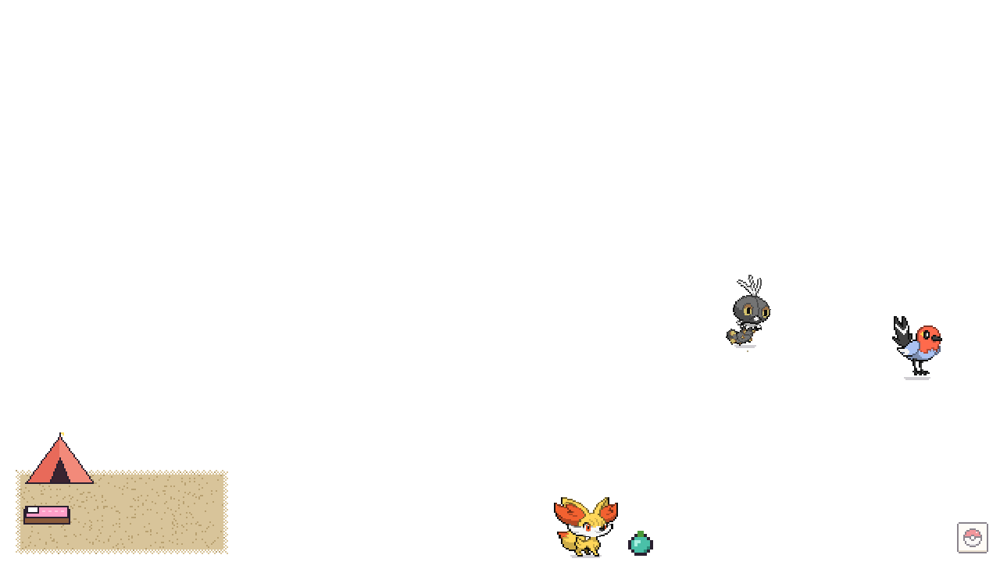

- **休息的果實**：連續用電腦 90 分鐘（中間停不到 3 分鐘都算連續），最親近你的那隻把一顆樹果帶到游標正下方的螢幕下緣，坐在旁邊等。不催你，也不會變多。
  - 你真的離開電腦 3 分鐘，在家的大家就走過去分著吃，每一隻都飽一點、開心一點、好感多一點（大約半個普通泡芙）。一天最多 4 顆。
  - 點果實只會說明「大家在等你離開電腦休息一下」。
  - 專注中不會放果實。
- **桌面的生氣**：今天做到幾件好事（有休息、完成一次專注、昨天準時睡，還有拍照一起做的有好好吃飯、有喝水），螢幕下緣的花草就長到幾級（0～3，最多 3 級）。每天留下一朵小花排在下緣中間，最多 7 朵，像一週的足跡。
- **一起累**：前一天最後一次用電腦過了 01:00，隔天早上大家打哈欠、走慢一點，中午恢復。**只是演出**：不扣好感、飽足、成長，不寫進記憶，也沒有責怪的話。
- **你出現了**：每天第一次看到你，在家的夥伴成長多一點點。靠的是你出現，不是你點了什麼。
- 從你的行為來的效果**只加不減**。兩台電腦同步時同一天取最大值，同一次離開不會算兩次。
- 「休息」只看有沒有在操作電腦，看不到你是不是在看螢幕（看影片、讀文件也可能被當成休息）。為了隱私，不讀視窗標題或程式名稱。

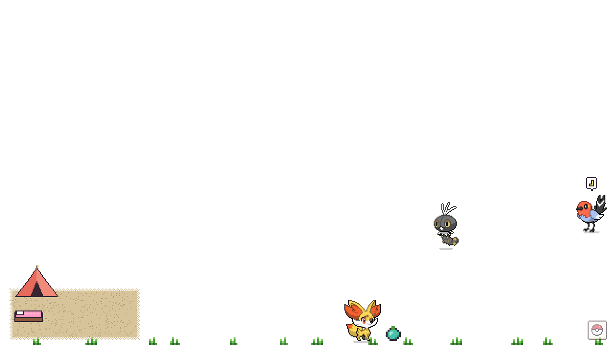
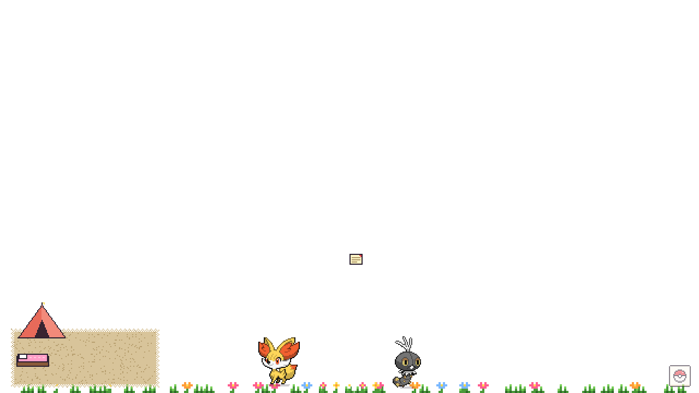

### 帶一隻出門

（`src/core/outing.js`）你要出門的時候，帶一隻夥伴一起去。

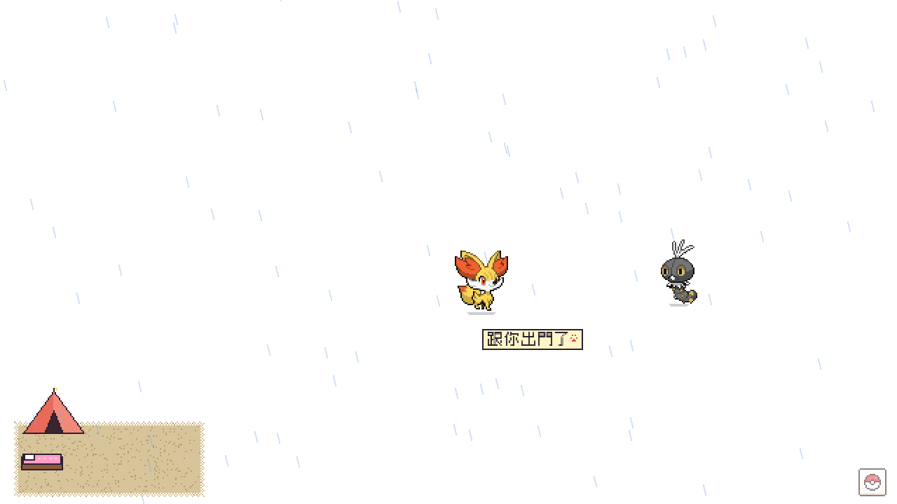

- **出門**：用滑鼠把夥伴拖到螢幕左邊或右邊的邊緣放開（拖過去時會說「放開就帶牠出門」），或在夥伴頁按「帶牠出門」。牠揮揮手走出螢幕，原來待的地方留一張「跟你出門了」的紙條。
- **在外面**：手機頁面最上面會顯示牠、出門多久，還有一句依時間和天氣組出來的話。天氣是設定裡那個城市的，所以寫「家裡那邊下雨了」。app 不知道你在哪裡，也不會去查。
- **回家**：回到電腦前點那張紙條（或夥伴頁的「回來了」），牠從螢幕邊邊跑回紙條那裡。
  - 出門 20 分鐘以上，牠會給你一張「今天跟你出門」的明信片（出門多久、幾點回來、那時家裡那邊的天氣），放進相簿，好感也會增加（跟摸一次一樣多）。
  - 不到 20 分鐘就不給明信片。
- 一次只能帶一隻。出門中的夥伴不在桌面上，也不能去旅行或被收回。
- 出門跟**旅行**不一樣：旅行是牠自己去卡洛斯的某個地方，時間到了自己回來；出門是跟著你，只有你能帶牠回家。
  - 「你回到電腦前」不會自動算成回家，因為你可能只是去倒杯水。
  - 如果忘了帶牠回來，12 小時後牠會自己回家，這次沒有明信片，只會問一句「你忘記帶我回來了嗎？」
- 手機頁面還是**只能看**：出門和回家都在電腦上操作。

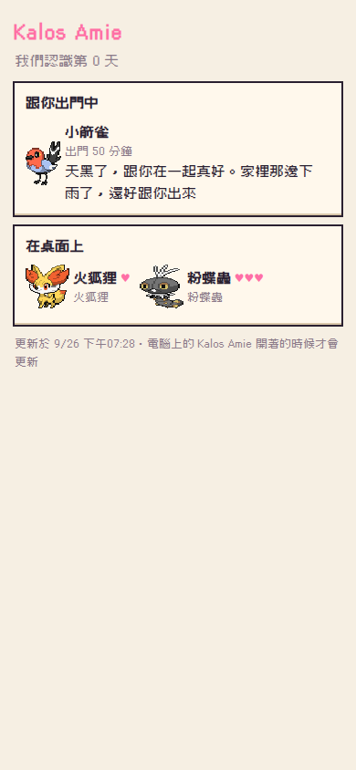
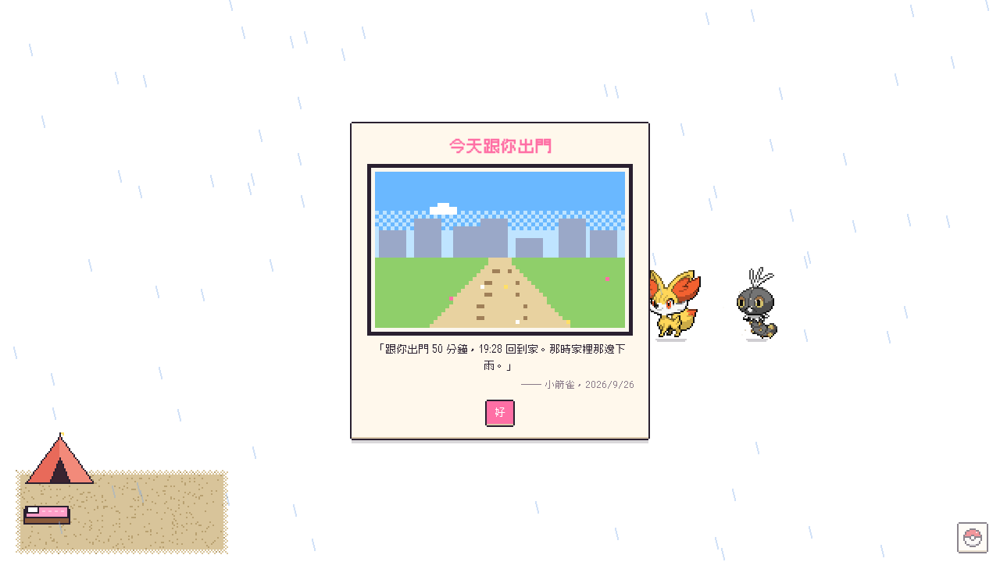

### 牠們感受得到你的世界

（`src/core/world.js`、`src/core/sun.js`）全部都是桌面上的動作，不是通知。

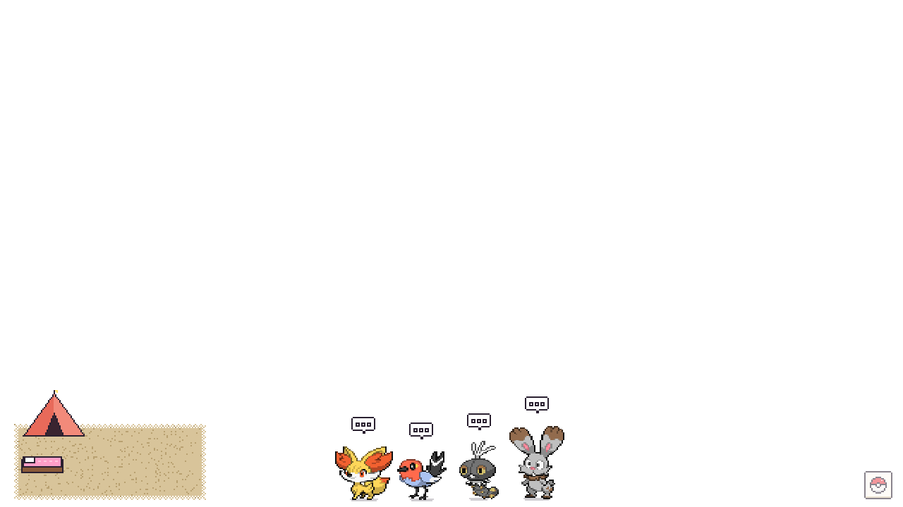

- **日落**：設定裡那個城市日落前後 10 分鐘，有空的夥伴會一起看日落，一天一次。
  - 有視窗的時候：跳到最上層視窗的頂邊排排坐，面向西邊（畫面的左邊）。
  - 沒有視窗的時候：坐在螢幕下緣。
  - 日出日落用 NOAA 的公式算，跟獨立的天文星曆比對，誤差在幾秒以內。
  - 沒設定城市就不會發生，不會猜一個城市。
- **下雨**：家裡那邊下雨或打雷時，沒事做的夥伴會擠到游標旁邊躲雨，天晴了就散開。
  - 牠們會走向你，所以跟其他主動的動作一樣受打擾額度限制。
  - 專注中不會發生。
- **你不在**：離開電腦 10 分鐘以上，醒著的夥伴會自己玩鬼抓人，想睡的會回基地睡。
  - 你回來時，牠們不會同一刻一起轉頭：每一隻過 0.5～4 秒才陸續發現你。
  - 只有最親近的那一隻會跑過來。
- **全螢幕**（看影片、簡報）：所有夥伴躲到右下角、變小、不出聲，也不會有野生寶可夢或任何打擾；退出全螢幕就回來。
  - 最大化的視窗不算全螢幕：最大化只蓋住工作區，全螢幕會連工作列一起蓋住。
  - 全螢幕看影片的時間不算「休息」，所以不會因此吃掉休息的果實。
- 全螢幕和「坐在視窗上」要讀視窗的位置，目前只有 Windows 支援。在 macOS／Linux 上，全螢幕不會啟動，日落一律坐在螢幕下緣。

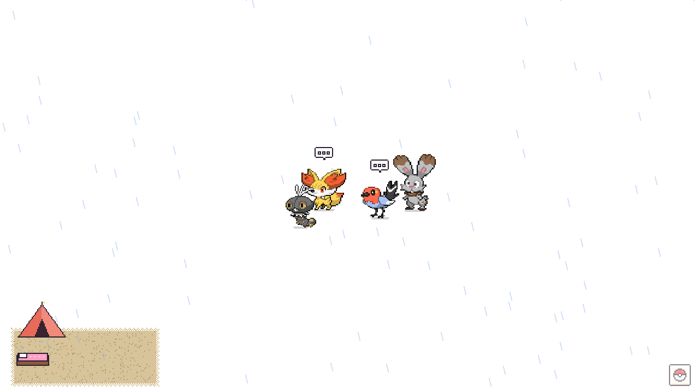
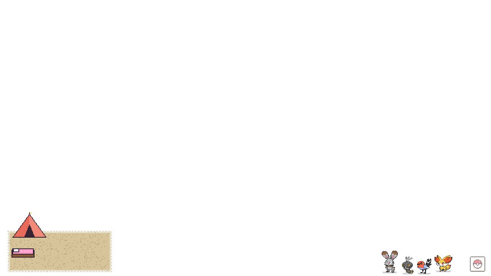

### 牠們自己的生活

（`src/core/life.js`）牠們跟你過一樣的日子：會喝水、看書、吃東西、打盹、睡覺、玩、散步。
不是等你做了什麼才回應，是牠們本來就這樣過。

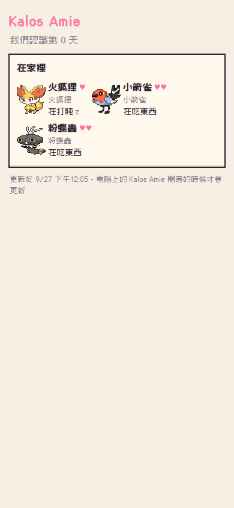

- **照真實時間過**：一天切成 10 分鐘一格，每一格牠在做什麼是固定的。你不在的時候牠們也照樣過（像動物森友會）。
- **跟你的作息一樣**：
  - 你平常睡的時候牠們也在睡：用你最近一週第一次、最後一次用電腦的時間推算；不到一週先用 23:30～07:30。
  - 中午、傍晚的吃飯時間，大家多半在吃東西。
  - 醒著的時候大約每 90 分鐘喝一次水；下午比較常看書、打盹；快睡前比較安靜。
- **每隻個性不同**：外向的比較常玩，內向的比較常看書，愛睡的比較常打盹（照性格）。
- **手機上**：「在家裡」那一區，每隻旁邊寫著牠現在在做什麼（「小箭雀在喝水」），小圖做對應的動作。
  - 摘要裡帶著往後 24 小時的生活表，手機照時間查。
  - 連不到電腦時，牠們也照樣換下一件事做（最多 24 小時）。
  - 手機上寫的跟電腦算的一定一樣。
- **桌面上（你在家時）**：牠們偶爾自己去喝水、看書、吃東西，旁邊擺著杯子、書、碗。
  - 這一格在喝水的那隻，比較容易去喝水。
  - 同一件事做完 8 分鐘內不會再做。
  - 不出聲、不跳通知、不走向游標，所以不算打擾。
- **不會變差**：你晚睡、沒打開手機，牠們都照樣過得好，沒有「肚子餓」「好寂寞」這種事。

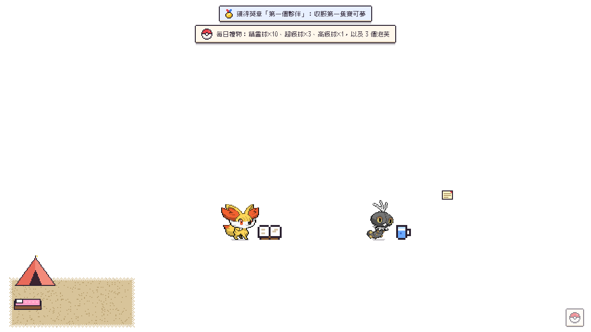

猜的數字（`src/core/life.js`、`src/renderer/scene/lifeacts.js`）：一格 10 分鐘、預設 23:30～07:30 睡覺、你最後一次用電腦後 20 分鐘牠們就睡、第一次用電腦前 10 分鐘就醒、吃飯時間 12:00～13:00 和 18:30～19:30、每 90 分鐘喝一次水、這一格在做的事被選到的機會變成 4 倍、同一件事隔 8 分鐘。

### 拍照，一起做

（`src/core/checkin.js`、手機的 `src/phone/snap.js`）你在外面拍下你正在做的事，牠就在同一刻跟你做一樣的事。

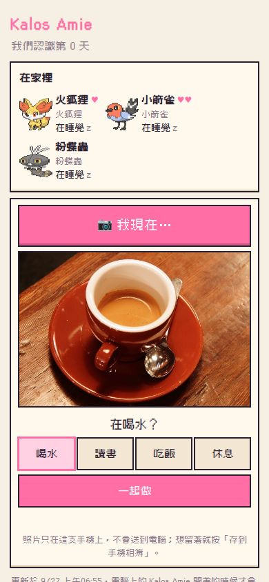
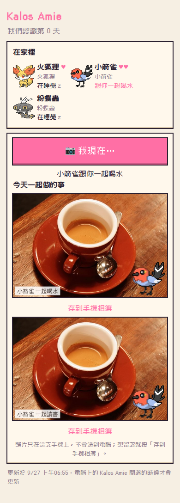

1. 手機頁面最下面按「📷 我現在…」，拍一張（或選一張）照片。
2. **這支手機自己猜**你在做什麼（COCO-SSD，模型跟著 app 一起來，不連任何網路服務，也不用 API key）：
   - 杯子、瓶子 → 喝水；書、筆電 → 讀書；碗和食物 → 吃飯；床、沙發 → 休息
   - 猜的只是**預選**，選項都在、一樣大，可以直接點別的；什麼都認不出來就不預選。
   - 模型第一次按「📷」才載入（大約 19 MB，手機會快取 7 天）。
3. 按「一起做」：跟你出門的那隻（沒出門就是在家最親近的那隻）馬上在手機上「跟你一起喝水」，一起做 10 分鐘。
   - 讀書的話牠陪你讀，直到你按「讀完了」或 50 分鐘。畫面很安靜：不倒數、不打分數。
4. **照片變成回憶**：夥伴的小圖畫在照片角落，存在手機裡的「今天一起做的事」，每張都可以「存到手機相簿」。
5. **回到家**：桌面上那隻那段時間的生活就是跟你一起做的那件事；旁邊留著杯子（書、碗、枕頭），
   滑鼠移上去寫「12:40 你喝水的時候，小箭雀也一起喝了」。你在家拍的話，桌面上那隻當下就去喝水。

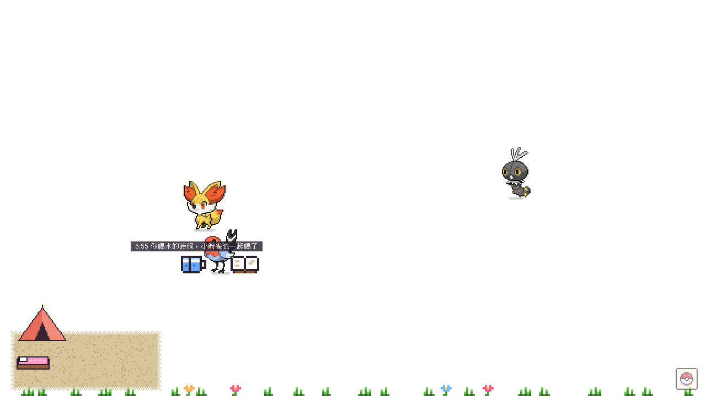

- **照片只在你的手機上**：只在手機上猜、只存在手機裡。送到電腦的只有「幾點、做什麼」（`{ kind, id, at }`），
  電腦那邊一次最多收 1 KB，照片本來就送不過去。
- iPhone 的 Safari：沒加到主畫面的網站，7 天沒打開會被清掉資料，**照片也會不見**。想留著就按「存到手機相簿」。
- 只加不減：沒拍照不會怎樣，沒有連續天數。一起做的事算進今天做到的好事（喝水、吃飯、休息、讀書各算一件）。
- 同一張確認送了好幾次只算一次（每次有自己的 id）；手機的時間不準的話用電腦的時間。

猜的數字：預選要信心 0.5 以上、照片縮到 640 px、一起做 10 分鐘（讀書 50 分鐘）、痕跡留 12 小時、最多 3 個、模型快取 7 天。

### 在手機上看

設定 →「在手機上看」打開以後，電腦上的 app 會開一個小網頁，手機掃畫面上的 QR code 就能看：
跟你出門中的夥伴、今天的心情和認識第幾天、在家的夥伴現在在做什麼、旅行中的夥伴（什麼時候回來）、信箱（點一下展開）、明信片、我們的里程碑，還有「📷 我現在…」（上面的「拍照，一起做」）。
除了拍照一起做，其他都只能看；電腦上的 app 開著的時候才會更新（每 30 秒）。

**同一個 Wi-Fi**：手機和電腦連同一個 Wi-Fi，掃「同一個 Wi-Fi」那個網址的 QR code。
第一次打開時 Windows 可能會問要不要讓 Kalos Amie 使用網路，選「私人網路」就好（不要勾公用網路）。

**出門也想看：用 Tailscale**（免費、不用改路由器，也不會把網頁公開到網路上）
1. 到 [tailscale.com](https://tailscale.com/download) 下載，電腦和手機都裝，用**同一個帳號**登入
2. 電腦上重新打開「在手機上看」（或重開 app），網址清單會多一個「Tailscale：http://100.x.x.x:…」
3. 手機上打開 Tailscale（保持連線），點設定裡那個網址旁邊，換成它的 QR code 掃一次，加到主畫面
4. 之後手機在外面用行動網路也打得開（電腦要開著、app 要開著）

**在外面也能用：斷網也看得到牠們、拍照也能先存著**（Tailscale HTTPS＋service worker）

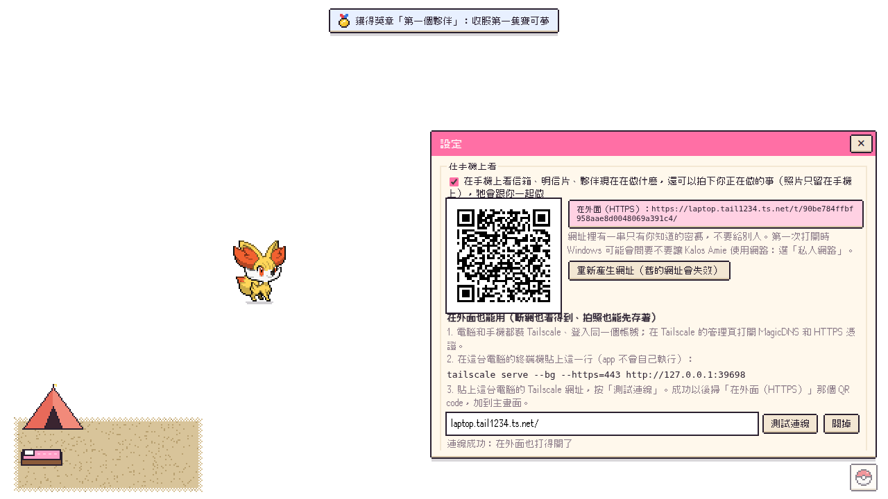
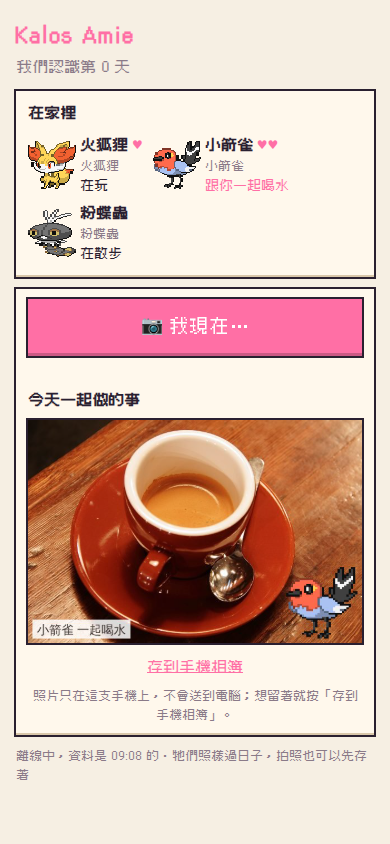

1. 在 [Tailscale 的管理頁](https://login.tailscale.com/admin/dns) 打開 **MagicDNS** 和 **HTTPS 憑證**。
2. 設定 →「在手機上看」→「在外面也能用」：照上面寫的，在**這台電腦的終端機**貼上那一行
   `tailscale serve --bg --https=443 http://127.0.0.1:<連接埠>`（app 不會自己執行任何指令）。
3. 貼上這台電腦的 Tailscale 網址（像 `https://laptop.tail1234.ts.net`），按「測試連線」。成功以後掃「在外面（HTTPS）」那個 QR code，**加到主畫面**。

打開以後：
- 頁面和牠們的生活表存在手機上。手機斷網、電腦關機，打開頁面還看得到牠們照真實時間在做什麼，最下面寫「離線中，資料是 HH:MM 的」。
- 辨識照片的模型也存好了：斷網也能拍照、猜、一起做。確認的事先存在手機上，連回電腦就照順序送出；桌面上的時間是**你按下去的那一刻**，不是送到的時間（最多相信到 24 小時前）。
- 重新產生網址以後，舊網址會寫「網址換了，請重新掃 QR code」，手機上存的東西也一起清掉。
- **電腦才是唯一的資料來源**：手機上只存快取和還沒送出的事。iPhone 清掉資料（沒加到主畫面時 7 天沒打開會被清）也沒關係，連上電腦就全部回來；**只有還沒送出的事和照片會不見**。
- 已知限制：斷網時手機上跟你一起做的是當時那一隻；如果連回電腦之前那一隻去旅行了，電腦會記成在家最親近的另一隻（手機連上以後照電腦的）。
- 安全：只有打開這個選項，電腦才多聽 127.0.0.1（`tailscale serve` 會把請求轉到這裡）；不聽 0.0.0.0。從 127.0.0.1 進來的請求照樣要網址裡的密碼，不相信任何 Tailscale 或代理加的標頭。網址只收 `*.ts.net`（測試連線時網址裡帶著密碼，不能送到別的網站）。**不要用 Tailscale Funnel**（會把頁面公開到整個網路）。

**安全**（`src/main/phone.js`）：
- 預設關閉
- 網址裡有一串 128-bit 的隨機密碼，沒有它一律 404；覺得外流了可以按「重新產生網址」，舊的馬上失效
- 只監聽區網（10.x、172.16–31.x、192.168.x）和 Tailscale（100.64–127.x）的位址，不對外公開
- 只提供摘要（`src/core/phonedata.js`），不會送出整份存檔；頁面不准執行內嵌程式，你取的暱稱一律當成文字顯示
- 唯一能寫的是「拍照一起做」的 `POST act`：只收 JSON、同一個網址來的、1 KB 以內、每分鐘 20 個以內，而且只能是 `{ kind, id, at }` 三個欄位
- 手機辨識用的檔案（`src/phone/vendor`）一個一個列在白名單裡；來源、版本、授權和改過的地方寫在 `src/phone/vendor/LICENSES.md`
- QR code 是自己寫的產生器（`src/core/qr.js`，不加套件），跟 Nayuki 的 QR Code generator 逐格一樣

**隱私**：遊戲只讀其他視窗的**位置和大小**（讓寶可夢站在標題列上），**不讀視窗標題、程式名稱或內容，也不讀按鍵**。
「好像在打字」是用「系統閒置時間 < 1 秒，但游標 2 秒沒動」推測的，不讀鍵盤。

傳說與幻之寶可夢各有條件：
好感滿點的夥伴會引來仙子伊布；哲爾尼亞斯、伊裴爾塔爾在主線故事裡遇到（兩隻都拿得到）；
捕獲 20 種後桌面上偶爾會掉基格爾德核心，集滿 10 顆會引來基格爾德；還有蒂安希、胡帕、波爾凱尼恩的條件等你發現。

### 物理

夥伴之間有碰撞體積（寫在 `src/renderer/scene/physics.js`），不會互相穿過去：

- 每隻在桌面上有一個扁橢圓的「腳印」，重疊時會軟軟地互相擠開；越重（圖鑑體重）越推不動
- 招式打中會被擊退：衝撞最遠，擴散類的會把旁邊的一起推開；效果絕佳退更遠、沒有效果不會動
- 把夥伴丟出去撞到別隻，會像撞球一樣把對方撞飛，還可能連環撞；撞得很大力的會頭暈，睡著的會被撞醒
- 跑太快迎面撞在一起會彈開、冒星星；切磋時每次碰撞兩邊都會被彈開，鬼抓人被抓到會被拍出去一小段
- 會飄的從上面飛過去不會撞到；鑽在地下、淡出中的鬼魂、捉迷藏躲起來的、騎在背上的不參與碰撞；抱抱、蹭蹭這類刻意貼在一起的動作不會被推開
- 疊得很深時（招式、互動剛結束）一次推開；貼著螢幕邊緣推不動的那一邊，由另一隻多退一點
- 跳起來的招式或動作靠近螢幕上緣時會跳低一點，頭不會跑出螢幕

### 跟電腦一起

- **站在視窗上**（Windows）：寶可夢偶爾會跑到其他視窗的標題列上坐著。視窗慢慢移動會跟著走；
  很快地拖走、最小化、關掉，牠會掉下來（還可能撞到地上的夥伴）；被別的視窗蓋住就自己跳下來。
  只會站在看得到的那一段頂邊上，一個頂邊最多 2 隻
- **專注番茄鐘**：選單或系統匣的「開始專注」（長度在設定裡調，15–60 分鐘）。專注中寶可夢只會安靜地坐著、睡覺，
  不會有野生寶可夢，沒有音效、音樂變小聲，左下角顯示剩餘時間。完成了拿到一個泡芙、外出的夥伴好感 +5；
  連續專注天數越多泡芙越好。中途結束沒有懲罰。計時是用開始時間算的，電腦睡眠回來也不會算錯
- **打字反應**：連續打字超過 30 秒，會有 1–2 隻跑到游標旁邊圍觀（3 分鐘最多一次）
- **孵蛋**：感情是「最好的朋友」的兩隻都在桌面上時，每天有一次機會找到蛋（最多 3 顆）。
  移動游標、在電腦前待著就會累積步數，大部分 1–2 天孵化。好了之後蛋會出現在桌面上，點一下看牠孵化。
  孵出來的是父母其中一隻的最初型態（花色、花紋會遺傳），傳說和幻之寶可夢不會生蛋

### 天氣、獎章、兩台電腦同步

- **天氣**：設定裡輸入城市（例如「中壢」）。每 30 分鐘查一次目前的天氣：
  下雨時水屬性 ×2、黏美兒 ×4；晴天火、草 ×1.5；下雪冰 ×2；打雷電 ×2。下雨下雪時畫面上有一層淡淡的雨／雪（不會擋住點擊）。
  查不到（沒網路）就沿用上一次的天氣
- **獎章**：選單的「獎章」，26 個（圖鑑、色違、交流、小遊戲、專注、孵蛋、形態、傳說）。
  收集 20 個之後，下一隻粉蝶蟲會是**幻彩花紋**；全部收集是**球球花紋**（原作的配信限定花紋）
- **兩台電腦同步**：設定裡「選同步資料夾」，選一個你自己的雲端同步資料夾（Google Drive、OneDrive、Dropbox…），
  另一台電腦選同一個資料夾，每 5 分鐘（還有關掉程式時）同步一次。不是「整份蓋掉」，而是逐項合併：
  兩邊抓到的寶可夢都會在、圖鑑取比較多的、背包的東西是兩邊各自的增減加起來（同步幾次都不會重複加）。
  第二台電腦加入時可以選「用資料夾裡的存檔」或「兩份合在一起」

### 一起玩（小遊戲）

選單的「一起玩」，選一隻夥伴：

| 遊戲 | 玩法 | 獎勵 |
|---|---|---|
| 摘樹果 | 桌面上長出一棵樹，夥伴去撞樹，30 秒內點掉下來的樹果接住 | 樹果（一場最多 15 顆） |
| 做泡芙 | 選 3 顆樹果 → 按住畫圈攪拌（速度要穩）→ 指針走到最右邊時取出 → 點 5 個地方放糖珠 | 泡芙；總分 90 以上是豪華、70 精緻、40 糖霜 |
| 頭球 | 球掉到夥伴頭上、圈圈亮起來時點一下 | 好感（連續次數，最多 +15） |
| 拼圖 | 夥伴的樣子切成 3×3，點兩片交換位置 | 滿足感 +20 |
| 超級特訓 | 選一項能力，20 秒內點破那個顏色的氣球 | 能力值（每個 +4，單項最多 252、總和最多 510）；切磋時比較容易打中，最多 +15% |

做泡芙每天最多 5 個、豪華泡芙每天最多 1 個，才不會比每日禮物和夥伴送的泡芙更划算。
玩小遊戲的時候不會有野生寶可夢出現。按 Esc、按 ✕、右鍵、開勿擾模式都會結束遊戲，而且一定會把滑鼠還給桌面。

### 招式

每一種寶可夢有 2～4 個招式（代表招式＋屬性招式，參考原作 X・Y），寫在 `src/renderer/scene/moves.js`，共 62 種，每一招有自己的演出（見下面的表）。

- 夥伴會自己對著前方練習招式
- 兩隻會切磋：輪流對彼此使出招式，依屬性相剋顯示「效果絕佳！」「效果不太好…」「好像沒有效果…」，結束後感情變好
- 點寶可夢 →「招式」可以叫牠使出指定的招式
- 只有演出，沒有傷害或對戰規則，也不影響捕獲

**演出（照原作 X・Y 的做法，`src/renderer/scene/movefx.js`）**

參考了 Pokémon Showdown 開源的招式動畫（只參考手法和時間，沒有複製程式或圖片），整理出四個原則：

1. 放招時背景會變：大招（光束、從天而降、流星群、在目標處打開…）放的時候，兩隻周圍的桌面局部變暗；流星群還會出現星空
2. 特效是「柔邊光團」疊出來的：用「變亮」疊加，重疊的地方越疊越亮
3. 同一個東西錯開時間放好幾個：例如流星每 0.13 秒落下一顆、飛水手裏劍 0.12 秒一片
4. 打到的瞬間爆開：光團放大 3 倍並淡出，加上打擊火花、衝擊波、往四周噴的亮線、各屬性的碎片，整個畫面頓一下再震一下

- **流星群**（新招式）：全身發出橘光 → 朝天空射出光球 → 6 顆帶尾巴的流星錯開落下，每顆落地都爆炸、噴石塊、地面震波。
  跟原作一樣只有很親近的才會：龍屬性而且好感滿了（5 顆心），招式會多一個流星群
- 效果絕佳更誇張：放射狀的光、第二道衝擊波、震比較久
- 設定裡的「減少閃光和畫面震動」：不震動、變暗和光都比較淡

**每一招自己的演出（`src/renderer/scene/choreo/`，分 4 個 PR 做，62 招全部做完）**

以前 62 招只有 9 種共用的動作（發射物、光束、衝撞…），差別只是顏色，飛水手裏劍看起來跟泡沫一樣。
62 招都換成自己的演出以後，那 9 種共用動作的程式已經刪掉（流星群的 meteor 留著）。
現在每一招有自己的外型、節奏、打中的樣子（只有流星群還用上面的 meteor，它本來就是獨一無二的）：

| 招 | 演出 |
|---|---|
| 水槍 | 細水柱受重力往下彎、沿路滴水，打中濺出皇冠形水花、地上留一灘水 |
| 泡沫 | 7 顆大小不同的泡泡慢慢飄、左右搖，2 顆半路自己破，碰到一顆一顆「啵」 |
| 水之波動 | 水球在手上脹縮 3 下再射出，沿路一圈圈漣漪，打中是地上的橢圓波紋 |
| 飛水手裏劍 | 3 片四刃手裏劍高速自轉、水平連射、拖水帶，留下 X 字刀痕，碎成扇形水滴 |
| 蒸汽爆炸 | 目標腳下發橘光、裂開，往上噴白色蒸汽柱，雲往上和兩邊翻滾 |
| 火花 | 「噗噗噗」3 顆小火星，貼地彈一下再跳到目標，冒小煙、火星往上飄 |
| 噴射火焰 | 越遠越寬、一直往上飄的錐形火焰，打中時目標周圍燒一圈、冒黑煙 |
| 魔法火焰 | 畫一圈紫色符文環，火球升起繞一圈、從上面落下，目標腳下噴出紫橘火柱 |
| 藤鞭 | 兩條帶葉子的藤蔓蛇行伸出，上下各甩一下（鞭尖「啪」），再縮回來 |
| 飛葉快刀 | 5 片葉子邊飛邊翻，像迴旋鏢繞過目標後面再勾回來，最後打成 X |
| 落英繽紛 | 五瓣花先在自己身邊轉成漩渦，再往前橫掃過目標，黏一下再飄落 |
| 木角 | 頭上長出木頭角衝過去，打中後綠色光點沿曲線流回自己 |
| 棉花孢子 | 棉球先噴到天上，再從目標頭上搖著飄下來、黏在身上 |
| 尖刺防守 | 地上爬出根，帶刺的藤順時針圍成半圓頂，刺一起抖、往外噴碎片 |
| 電擊 | 鋸齒閃電每 2 幀換形狀、閃 3 下，身上一圈小閃電；目標黑白交替閃（觸電） |
| 拋物面充電 | 頭上撐起碟形電弧，電花從目標被吸出、沿拋物線跳回碟子 |
| 蹭蹭臉頰 | 走過去左右蹭 3 下、臉頰冒電花，不把對方推開，目標身上留靜電毛毛 |
| 極光束 | 4 條分層彩帶波浪往前、底下垂著簾幕，目標身上彩色光帶往上流 |
| 冰礫 | 空中長出 3 根冰錐、一根接一根最快射出，碎成冰片、地上留霜 |
| 雪崩 | 目標頭上雪越堆越多，一整塊砸下來，目標被雪埋一半、雪慢慢融 |
| 冷凍乾燥 | 分岔冰紋沿地面爬到目標，冰塊包住 → 裂開 → 碎成雪花 |
| 猛推 | 往前一步，手掌高低交錯推 5 下，目標一點一點退，第 5 下才算打中 |
| 波導彈 | 8 條線往手上收（聚氣），藍球微微轉彎追過去，打中升起藍色光柱 |
| 飛身重壓 | 蹲低 → 高高跳起 → 目標腳下影子越變越大 → 砸下來，目標被壓扁 |
| 溶解液 | 3 坨紫色液體往上吐、落下，一路滴到地上、冒大泡泡 |
| 污泥炸彈 | 一大坨會晃的泥高高拋過去，放射狀濺開、黏一下才消失 |
| 泥巴射擊 | 6 塊泥又平又快連射，沿路甩到地上留一灘一灘，目標身上黏泥點 |
| 重踏 | 跺腳 2 下，隆起的土波往兩邊跑、頂起土塊，波經過的夥伴彈一下 |
| 千箭齊發 | 綠箭先往天上射，停一下，密集落在目標那一柱、插在地上 |
| 啄 | 衝過去，頭一點一點啄 3 下，每下一個金色三角形 |
| 空氣斬 | 2 片透明彎月刃從上下交叉飛過去，打中 X 字 |
| 勇鳥猛攻 | 往後退、包成拍著翅膀的藍火鳥，斜衝過去，自己被反彈、往後仰 |
| 暴風 | 目標腳下長出一層一層轉的龍捲風漏斗，把目標捲高再放下 |
| 死亡之翼 | 背後展開暗紅羽翼，一揮 → 羽毛組成的紅光，紅色光點吸回自己 |
| 念力 | 沒有東西飛過去：目標身邊一圈圈會扭的粉紅圈、頭上轉星星，在原地一下一下晃 |
| 精神強念 | 頭上一圈圈粉紅波紋、兩隻中間閃一下粉紅柔光，目標被舉到半空再砸下來 |
| 反射壁 | 六角形玻璃沿著身前一道弧一片一片拼成護罩（比自己高），反光掃過去 |
| 異次元洞 | 目標背後打開圓環洞，拳頭從洞裡打出來（目標往自己這邊飛） |
| 吐絲 | 白絲射出去一圈一圈纏住，下半身變成繭，最後一圈圈滑開 |
| 蝶舞 | 自己左右搖擺，4 隻蝴蝶沿 8 字形繞著飛、撒亮粉 |
| 力量寶石 | 3 顆寶石繞兩圈 → 排成稜鏡 → 射出彩虹色的光，打中 6 色折射 |
| 雙刃頭錘 | 往後退很多 → 頭包著岩石衝撞 → 碎石噴出，自己也頭暈冒星星 |
| 鑽石風暴 | 12 顆鑽石圍成圈 → 往前炸開成一面旋轉的鑽石牆橫掃過去 |
| 暗影球 | 嘴前聚成黑球（紫色火焰邊），大大地晃著飛，打中先往內吸再炸開 |
| 影子偷襲 | 影子沿地面伸到目標腳下，從影子伸出黑手往上打；自己變淡 |
| 萬聖夜 | 目標頭上浮出南瓜燈、咧嘴笑、眨眼，糖果噴出來、紫煙一圈 |
| 王者盾牌 | 從地上升起金邊金屬大盾，「鏗」一道斜白光，光澤掃過去 |
| 加農光炮 | 白點越變越大，射出最粗、邊緣是直的光炮，自己被後座力推退一步 |
| 龍之波動 | 兩色螺旋光束往前轉，最前面一顆龍頭，咬到目標炸開成漩渦 |
| 流星群 | （不動：本來就有自己的演出） |
| 撞擊 | 往後縮蓄力 → 帶速度線衝過去 → 自己壓扁、目標彈開 |
| 巨聲 | 3 道大弧形聲波「)))」只往前跑，目標一下一下震 |
| 爆音波 | 先吸氣變大 → 四面八方的鋸齒圈炸開 3 次，附近的夥伴全部彈一下 |
| 甜甜香氣 | 3 條粉紅波浪香氣線橫著慢慢飄過去，目標聞到冒愛心（不推開） |
| 咬住 | 目標上面出現上下兩排牙齒的大嘴，張開 →「喀」合上，留下齒痕 |
| 暗襲要害 | 周圍一下子全暗，自己消失、出現在目標背後，一道細細的橫線閃光，慢半拍才打中 |
| 顛倒 | 目標身邊 4 個箭頭打轉，目標翻成倒立、箭頭反過來轉 |
| 妖精之鎖 | 金色鎖鏈一節一節圍住目標，鑰匙轉一下「喀」，鎖鏈亮一下再消失 |
| 月亮之力 | 背後升起月亮（月牙變滿月），粉紅月光從上往下照到目標 |
| 妖精之風 | 沿正弦波飄的半透明風帶，亮片跟著吹過去，目標被吹得晃 |
| 魅惑之聲 | 音符和愛心慢慢飄、追著目標，一個一個啵，目標臉紅 |
| 大地掌控 | 自己發光，6 道彩色光柱一根一根升起，再一起往頭上收、爆出亮片 |

- 打中還是走原本的規則（擊退、對戰算一次打中）；頓一下、震一下的手感跟以前一樣，減少震動的設定一樣有效
- 蹭蹭臉頰不把對方推開；拋物面充電、冷凍乾燥、重踏、暴風、鑽石風暴的動作在兩隻中間，放招時變暗也放在中間
- 精神強念：桌面是透明的，沒辦法真的把後面的顏色反轉，改成兩隻中間閃一下粉紅柔光；減少閃光時精神強念、加農光炮的閃光、暗襲要害的全暗都很淡
- 猜的數字（可調整）：每招的時間（1.0–1.9 秒，打中在 0.45–1.16 秒）、手裏劍 3 片 0.12 秒一片、泡泡 7 顆、葉子 5 片、花瓣 20 朵、刺 13 根、猛推 5 下、千箭齊發上 10 支下 14 支、暴風捲高 22
- **怎麼確定每招都不一樣**（`test/e2e/moveprint.cjs`）：每招截 6 格、減掉放招前的畫面、只看亮度（換顏色的換皮要抓得到），
  同一招用兩個亂數種子跑的差距當「尺」，每一招跟最像的另一招要差 ≥ 尺 × 2（2 是量舊動畫之前就定好的）。
  舊的 62 招跑一次有 56 招不過；現在 62 招全部過，尺 0.753，最像的一對 2.41 倍（流星群本來就獨一無二，一樣拿來比）（固定亂數種子、等會動的圖載好、每招從頭播放，連跑結果完全一樣）
- 做的過程中用過一個例外（使用者同意）：尖刺防守跟還沒重做的 5 個「自己用」舊招差 1.8–1.9 倍（都在自己身上放、周圍一樣變暗）。
  5 招都重做以後例外全部自動失效，重新比都過了
- 限制：「變亮」疊加的光在白色桌布上比較淡（以前就是這樣）

### 色違

基本機率 1/512（桌面上遇到的次數比原作少，所以比原作高），以下會提高：

- **同種連鎖**：連續抓同一種寶可夢會形成連鎖，連鎖中的那一種比較常出現；連鎖 5／10／20／30 起，牠的色違機率一路提高（最高約 1/40）。連鎖中的那一種逃走、等太久離開、或你放牠走，連鎖就中斷
- **閃耀護符**：圖鑑捕獲 60 種後獲得
- **華麗／豪華泡芙誘餌**

色違的氣息點偶爾會閃一下；色違的寶可夢出現時有星星和提示，在桌面上也會不時閃光。
圖鑑會標記抓過色違的種類（✦），可以切換看色違的樣子；「氣息」視窗會列出目前的色違機率與連鎖。

### 形態

| 寶可夢 | 形態 | 怎麼決定 |
|---|---|---|
| 花蓓蓓、花葉蒂、花潔夫人 | 紅、黃、橙、藍、白 5 種花色 | 野生的隨機出現；進化時花色不變 |
| 粉蝶蟲、粉蝶蛹、彩粉蝶 | 18 種花紋（另外 2 種配信限定的之後當成就獎勵） | 跟原作一樣依你所在的地區決定，一個地區固定一種。這裡用電腦的時區判斷：台灣是驟雨花紋、日本（東京）是高雅花紋、法國是花園花紋 |
| 多麗米亞 | 9 種造型 | 在「夥伴」裡按「修剪」，花一個泡芙；5 天後毛會長回來 |
| 蒂安希 | 超級進化 | 好感第一次滿了拿到「蒂安希進化石」（不需要超級手環）。之後切磋一開始就會超級進化，也可以點牠叫牠超級進化（最多 5 分鐘） |
| 布里卡隆、妖火紅狐、甲賀忍蛙 | 超級進化（《傳說 Z-A》） | 超級手環＋進化石：你那一族的博士給（第 17 天），另外兩族破關後朋友們給 |
| 摔角鷹人、超能妙喵、火炎獅、龜足巨鎧、毒藻龍 | 超級進化（《傳說 Z-A》） | 可爾妮、葛吉花、帕琦拉、志米、朵拉塞娜打贏後給 |
| 烏賊王 | 超級進化（《傳說 Z-A》） | 特別事件：晚上來的國際刑警 |
| 甲賀忍蛙 | 牽絆變身 | 好感滿，而且有「最好的朋友」時，切磋中打中對手有機會變身 |

圖鑑會分開記錄每一種形態，可以點形態切換圖片。超級進化和牽絆變身只是暫時的樣子，不會存進存檔。

時區對花紋的表（`src/core/vivillon.js`）是用 `scripts/build-vivillon.mjs` 產生的：
取原作每個 3DS 國家／地區的經緯度與花紋（[abcboy101/vivillon](https://github.com/abcboy101/vivillon)，和 PKHeX 的合法性檢查表逐筆比對一致），
再用 IANA 時區資料庫裡每個時區代表城市的經緯度，找同一個國家裡最近的地區。3DS 沒有的國家用預設的花園花紋。

### 捕獲

沒有對戰、不會削血，捕獲率 = `(捕獲率/255)^0.75 × 0.85 × 球 × 投擲時機 × 泡芙`（夾在 2%–97%）。
球：精靈球 ×1、超級球 ×1.5、高級球 ×2；時機：不錯 ×1.1、很好 ×1.35、超棒 ×1.7；泡芙：喜歡的口味 ×1.8。
球會搖三下，每一下用 `p^(1/3)` 判定，所以搖了幾下是真的跟機率有關。
精靈球每 10 分鐘補 1 顆（上限 30），每天第一次開啟有每日禮物，抓到新種給超級球、每 10 種給高級球。

### 進化

沒有等級，改用「成長」（陪伴、撫摸、餵食累積）：原作進化等級 × 8 就是需要的成長值。
道具進化需要成長 240 + ♥3；通訊進化需要成長 240 + ♥4。
保留原作的特殊條件：寶寶暴龍白天、冰雪龍夜晚、頑皮熊貓要有惡屬性夥伴一起在桌面上、好啦魷要「倒過來」（把牠抓起來就會倒立）。

## 架構

完全在本機執行，沒有伺服器。Electron 一個主程序 + 一個全螢幕透明視窗。

```
data/kalos.json              72 種的名稱（繁中／日／英）、屬性、捕獲率、進化條件、圖鑑敘述、25 種性格
scripts/build-dex.mjs        從 PokeAPI（GitHub 上的靜態鏡像）產生 data/kalos.json
src/core/                    遊戲規則（純 JS，不碰 DOM／Electron，node --test 直接測）
  game.js                    唯一會改存檔的地方：交流、捕獲、進化、背包、每日禮物
  forms.js                   形態（花蓓蓓的花色、彩粉蝶的花紋、多麗米亞的造型、超級進化）與圖片 key
  items.js                   重要物品：超級手環、超級進化石（哪一種寶可夢、圖片）
  story.js  battle.js        主線故事（事件、徽章、獎勵、特別事件）／故事裡的對戰（傷害、好感、再挑戰）
  types.js                   屬性相剋表
  attention.js  routine.js   打擾額度（每小時幾次、排隊）／你的作息（早安、晚睡、專注兩小時）
  mood.js  together.js       每天的心情／你和大家（第一次見面、里程碑、每週的信）
  symbiosis.js               共生：休息的果實、今天的花草、一起累（畫面在 renderer/scene/garden.js、director.js）
  outing.js                  帶一隻出門：跟旅行互斥、明信片、12 小時自己回家（畫面在 director.js）
  world.js  sun.js           你的世界：全螢幕、下雨、你不在、日落／日出日落（NOAA 公式）
  life.js                    牠們自己的生活：每 10 分鐘在做什麼（時間的純函式，跟著你的作息；畫面在 renderer/scene/lifeacts.js）
  checkin.js                 拍照一起做：誰、幾點到幾點、一起做什麼（id 去重、手機時間夾住；手機在 src/phone/snap.js）
  calendar.js                節日（農曆日期表 2025–2040）、季節
  phonedata.js  qr.js        手機頁面看到的摘要／QR code 產生器
  vivillon.js                時區 → 彩粉蝶花紋（scripts/build-vivillon.mjs 產生）
  amie.js  capture.js  encounter.js  evolution.js  save.js  dex.js  rng.js  shiny.js
src/main/                    Electron 主程序
  main.js                    透明置頂視窗、滑鼠穿透、游標輪詢、系統匣、IPC
  store.js                   存檔（先寫暫存檔再 rename，保留一份 .bak）
  sprites.js                 寶可夢圖下載與快取（圖片 key 先驗證格式才拿來組路徑）
  syncfiles.js               同步資料夾的讀寫（只碰 kalos-amie/save.<裝置>.json）
  windows.js                 其他視窗的位置（Windows；只讀位置和大小，還沒接進遊戲）
  signals.js                 閒置時間、電源、CPU → 遭遇的「氣息」
  phone.js                   手機頁面的小網站（只監聽區網和 Tailscale、網址帶密碼；唯一的寫入是 POST act）
src/phone/                   手機頁面本身（index.html、phone.js、phone.css；拍照一起做 snap.js、snap.css；斷網也能用 sw.js）
  vendor/                    手機上辨識照片用的 TensorFlow.js＋COCO-SSD（只給手機，電腦不載入；授權見 LICENSES.md）
  preload.cjs                給 renderer 的窄介面（contextIsolation + sandbox）
src/core/minigames.js        小遊戲的計分與獎勵（純函式）
src/core/perch.js focus.js eggs.js   視窗頂邊、番茄鐘、孵蛋的規則（eggdata.js 由 scripts/build-eggs.mjs 產生）
src/core/weather.js achievements.js sync.js   天氣、獎章、同步的合併規則
src/core/letters.js          寫信（範本、觸發、每天上限、同步）
src/core/base.js             秘密基地（升級、家具格子、地板、材料、同步）；畫面在 renderer/scene/base.js、home.js（鑽進住的地方睡）
src/core/trips.js            出門旅行（地點、結算、同步）；明信片的圖在 renderer/gfx/postcards.js
src/core/mind.js memory.js   心智（需求、個性、心情、理由）與記憶；scene/mindlink.js 把它接到 Pet.decide()
src/renderer/scene/locomotion.js   移動：加減速、轉身、步頻、散步路線、走走停停、繞開別隻（Pet.moveTo 用）
src/renderer/gfx/rig.js      像素木偶：自動切塊、參數姿勢 pose()（量化＋快取）、每組動作的「步相 → 參數」；gfx/sprites.js 的 PuppetView 用彈簧追參數；scene/pet.js 的 toPuppet 把整張圖的姿勢翻成木偶參數
src/renderer/gfx/skeleton.js 骨架木偶：手標骨架的手腳有關節（蒙皮、兩段 IK 踩地、步態）、跟 rig.js 同一個介面；gfx/skeletons.js 是每一隻標的關節和外框
src/core/ethogram.js         物種生活表：72 隻怎麼過日子（時間分配、作息、屬性對環境、外型對動作）與 nextBout()（下一件事做什麼、做多久）
src/renderer/                畫面
  app.js                     進入點與主迴圈
  director.js                把規則、舞台、介面串起來（遭遇流程、進化演出、誘餌）
  scene/                     canvas 上的東西：stage（輸入與穿透判定）、pet、wild（氣息點、野生、球、道具）、fx
  scene/choreo/              每一招自己的演出（一個屬性一個檔案；moves.js 的 CHOREO 先看這裡，沒有才用共用的 kind）
  gfx/                       像素工具與自製美術
  audio/                     chiptune 合成器與原創曲目
  ui/ui.js                   選單、夥伴、圖鑑、背包、氣息、設定、對話框
  ui/minigames/              小遊戲：host.js（開關、滑鼠）＋ 每個遊戲一個檔案
```

**唯一的架構規則：`src/core/` 不能 import 任何 DOM、Electron 或 renderer 的東西。**
遊戲規則只透過 `Game` 改變狀態、透過事件通知畫面；畫面只負責演出。

滑鼠穿透：視窗預設 `setIgnoreMouseEvents(true, { forward: true })`。主程序每 33ms 把游標位置送給 renderer，
renderer 用寶可夢圖的透明度遮罩判斷游標是否停在牠身上，需要時才請主程序切換成可點擊。
所以就算游標在別的視窗上，寶可夢也能看著你、被你摸到。

存檔在使用者資料夾的 `save.json`（Windows：`%APPDATA%/kalos-amie`）。有變動 3 秒內寫入、每 30 秒保底一次、關閉時再寫一次；夥伴在桌面上的位置也會記住，下次打開回到原位。格式有版本號（目前是 v2），`save.js` 的 `migrate()` 負責修正舊版或壞掉的存檔；v1 的存檔讀進來不會少任何東西。

## 已知限制

- 目前只在主螢幕顯示；系統匣有「移到游標所在的螢幕」
- Linux 上透明視窗與滑鼠穿透依桌面環境而定（Windows、macOS 最穩）
- 站在視窗上目前只有 Windows（`src/main/windows.js`，用 PowerShell，不需要原生模組；macOS、Linux 還沒做）。
  在 Windows 11 上實測：每次查詢 p95 2.2 ms、CPU 0.01%

## 素材與版權

寶可夢名稱、圖片與相關商標屬於任天堂／Creatures／GAME FREAK。這是個人非商業的同人專案。
寶可夢圖片不包含在 repo 內，執行時才從 [PokeAPI/sprites](https://github.com/PokeAPI/sprites) 下載到本機；
主線故事的人物圖來自 [Pokémon Showdown 的訓練家圖](https://play.pokemonshowdown.com/sprites/trainers/)（備用來源是同一批圖在 [smogon/sprites](https://github.com/smogon/sprites) 的原始檔），同樣只在執行時下載、不放進 repo；其中有些是同好畫的，作者請見該頁的說明。
圖鑑資料來自 [PokeAPI](https://pokeapi.co/)，其中 19 種沒有官方繁中敘述，是由英文翻譯（遊戲內標示「非官方翻譯」）。
手機辨識照片用的 TensorFlow.js 4.22.0 和 COCO-SSD 2.2.3（含模型）是 Apache-2.0，放在 `src/phone/vendor`，授權全文和改過的地方見 `src/phone/vendor/LICENSES.md`。
測試用的杯子照片是 scikit-image 內附的 CC0 照片（Rachel Michetti 攝），見 `test/fixtures/snap/SOURCES.md`。
音樂與音效為原創。介面字型為 [俐方體 11 號（Cubic 11）](https://github.com/ACh-K/Cubic-11)，授權見 `src/renderer/fonts/OFL.txt`。
