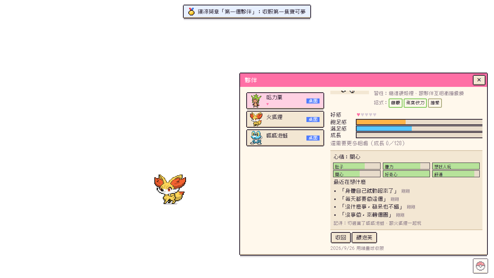
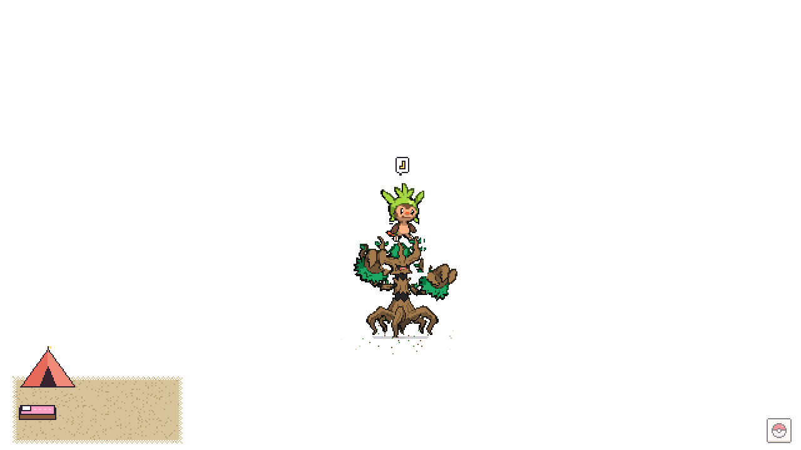

# Kalos Amie 卡洛斯桌面夥伴

[](LICENSE)
[](https://github.com/MarcusTseng0101/Pok-mon-feeding-on-laptop-/releases)

讓卡洛斯的寶可夢住在你的桌面上。牠們在整個桌面上走來走去，永遠浮在所有視窗上面，但不會擋到你工作：
滑鼠平常直接穿過去，只有停在寶可夢身上才摸得到牠。

仿《寶可夢 X・Y》的「寶可夢交流」：摸摸牠、餵泡芙提升好感，點桌面上冒出來的草叢遇見野生寶可夢，丟球捕獲、填滿圖鑑。
範圍是卡洛斯新登場的 72 種（No.650 哈力栗 ～ No.721 波爾凱尼恩）。



## 特色

- **像真的住在桌面上**：72 隻全部有手標的骨架，走路踩地、尾巴慢半拍、每一隻照現實裡最像的動物動（青蛙跳、蝸牛爬、猛禽盤旋…）
- **牠們有自己的生活**：會散步、發呆、找夥伴玩、睡午覺；有自己的心情和記憶，會寫信給你、出門旅行寄明信片
- **秘密基地**：擺家具、搭帳篷，累了自己鑽進去睡
- **主線故事、道館對戰、超級進化、色違、形態**、五個小遊戲
- **跟你的電腦一起**：站在視窗的標題列上、番茄鐘陪你專注、你打字牠也忙起來、天氣和日落
- **在手機上看**：手機掃 QR code 就能看牠們現在在做什麼（只在你家的 Wi-Fi 或你自己的 Tailscale 裡）
- **原創 chiptune 音樂和音效**，全部即時合成；寶可夢以外的美術都是程式畫的像素圖
- **完全在你的電腦上跑**：沒有帳號、沒有伺服器、不用 API key；不讀你的鍵盤、視窗標題或內容

<p>
  
  
</p>

## 安裝

### Windows（最簡單）

1. 到 [Releases](https://github.com/MarcusTseng0101/Pok-mon-feeding-on-laptop-/releases/latest) 下載其中一個：
   - **`Kalos Amie Setup x.y.z.exe`**：安裝版，會放進開始功能表，可以從「設定 → 應用程式」解除安裝
   - **`Kalos Amie x.y.z.exe`**：免安裝版，點兩下就能玩（放在隨身碟也行）
2. 打開時 Windows 可能會跳出 **「Windows 已保護您的電腦」**：這是因為安裝檔沒有付費的程式碼簽章，不是病毒。
   按 **「其他資訊」→「仍要執行」** 就可以了。（不放心的話可以照下面「從原始碼執行」自己跑）
3. 第一次打開會請你選一隻最初的夥伴。

> 第一次見到某一種寶可夢時，會從網路下載牠的圖（[PokeAPI/sprites](https://github.com/PokeAPI/sprites)），之後存在電腦裡，沒網路也能玩。

### macOS、Linux（或想自己跑原始碼）

目前只有 Windows 的安裝檔，其他系統請從原始碼執行（macOS、Linux 也能自己打包，見下面）：

1. 安裝 [Node.js](https://nodejs.org/) 20 以上（選 LTS 版）和 [Git](https://git-scm.com/)
2. 打開終端機：

   ```bash
   git clone https://github.com/MarcusTseng0101/Pok-mon-feeding-on-laptop-.git kalos-amie
   cd kalos-amie
   npm install
   npm start
   ```

3. 之後要玩，進到 `kalos-amie` 資料夾再打 `npm start` 就好。要更新到最新版：`git pull` 然後 `npm install`。

想自己打包成安裝檔：`npm run dist`（要在那個作業系統上打包：Windows 產生 `.exe`、macOS 產生 `.dmg`、Linux 產生 `.AppImage`，放在 `dist/`）。
macOS 自己打包的沒有簽章，第一次要在 Finder 裡按右鍵 →「打開」。

### 怎麼關掉、怎麼解除安裝

- **關掉**：工作列右下角（系統匣）的精靈球圖示 → 右鍵 →「結束」
- **開機自動啟動**：同一個選單裡的「開機時自動啟動」
- **暫時收起來**：選單裡的「勿擾模式（收起寶可夢）」
- **解除安裝**：安裝版從「設定 → 應用程式」移除；免安裝版直接刪掉 exe。
  存檔不會跟著刪，想全部清掉再刪 `%APPDATA%\kalos-amie`（macOS：`~/Library/Application Support/kalos-amie`，Linux：`~/.config/kalos-amie`）

## 怎麼玩

| 動作 | 做法 |
|---|---|
| 撫摸 | 游標在寶可夢身上**來回**滑動（不用按滑鼠）。滿足感滿了之後，好感度就不再因為撫摸增加 |
| 餵泡芙 | 點寶可夢 →「餵泡芙」→ 選泡芙 → 把泡芙拿到牠嘴邊。吃太飽會拒絕 |
| 抓起來 | 按住寶可夢拖曳到桌面任何地方，放開會掉下來、甩出去會滑一段（甩太用力會暈） |
| 遇見野生寶可夢 | 桌面上出現草叢、水窪、石頭、鬼火，或天空有影子掠過時，點一下 |
| 捕獲 | 在遭遇列選一顆球，瞄準圈縮到最小時點寶可夢。先給泡芙會提高捕獲率、降低逃跑率 |
| 選單 | 右下角的精靈球，或系統匣圖示 |

每個功能的完整說明（好感度怎麼算、主線故事、秘密基地、招式、色違、進化條件…）在 **[玩法詳解](docs/GUIDE.md)**。

### 在手機上看

設定 →「在手機上看」打開，手機掃畫面上的 QR code 就能看牠們現在在做什麼、讀信、看明信片，還能「拍照，一起做」（照片只留在手機上辨識，不會送到電腦）。

- **同一個 Wi-Fi**：手機和電腦連同一個 Wi-Fi 就能看。Windows 問要不要讓 Kalos Amie 使用網路時，選「私人網路」（不要勾公用網路）。
- **出門也想看**：電腦和手機都裝 [Tailscale](https://tailscale.com/download)（免費），用同一個帳號登入；重開「在手機上看」，網址清單會多一個 Tailscale 的網址，掃那個就好。
- **斷網也看得到、拍照先存著**：用 Tailscale HTTPS，步驟見 [玩法詳解：在手機上看](docs/GUIDE.md#在手機上看)。

網址裡有一串隨機密碼，只在你的區網和 Tailscale 裡聽得到，不會公開到網路上；預設是關的。

## 隱私

- 全部在你的電腦上跑，沒有帳號、沒有伺服器，也不連任何 AI 服務
- 會連網的只有：第一次下載寶可夢和人物的圖、查天氣（有在設定裡輸入城市才會查，用 [Open-Meteo](https://open-meteo.com/)，只送你輸入的城市和它的經緯度）
- 只讀其他視窗的**位置和大小**（讓寶可夢站在標題列上），不讀視窗標題、程式名稱、內容，也不讀鍵盤
- 存檔在 `%APPDATA%\kalos-amie\save.json`，只在你的電腦上（想兩台電腦同步，可以在設定裡選一個你自己的雲端同步資料夾，例如 Google Drive、OneDrive、Dropbox）

## 已知限制

- 目前只在主螢幕顯示；系統匣有「移到游標所在的螢幕」
- Linux 上透明視窗與滑鼠穿透依桌面環境而定（Windows、macOS 最穩）
- 站在視窗上目前只有 Windows（macOS、Linux 還沒做）

## 參與開發

歡迎開 Issue 回報問題或提 Pull Request。開發指令、測試、架構都在 **[開發與測試](docs/DEVELOPMENT.md)**：

```bash
npm install
npm run dev        # 開發模式：野生寶可夢很快出現、設定裡有「立刻生成」「補滿道具」
npm test           # 單元測試
```

幾個原則：遊戲規則都在 `src/core/`（純 JS，不碰畫面，`node --test` 直接測），畫面只負責演出；
不加新的 npm 套件、不連 AI 或雲端服務；介面文字用繁體中文。在這個 repo 用 AI 寫程式的話，規則寫在 [CLAUDE.md](CLAUDE.md)。

## 授權

程式碼以 [MIT 授權](LICENSE) 釋出，可以自由使用、修改、再發布，保留授權文字就好。

**MIT 授權只包含這個專案自己寫的程式碼、音樂、音效和程式畫的美術。** 下面這些不在範圍內，各自屬於原本的權利人：

- 寶可夢的名稱、圖片、圖鑑文字與相關商標屬於任天堂／Creatures／GAME FREAK。**這是個人非商業的同人專案，跟任天堂、The Pokémon Company 沒有任何關係。**
  寶可夢圖片不放在 repo 裡，執行時才從 [PokeAPI/sprites](https://github.com/PokeAPI/sprites) 下載到你的電腦（`docs/screens/` 的截圖裡看得到）。請不要拿來賣。
- 主線故事的人物圖來自 [Pokémon Showdown 的訓練家圖](https://play.pokemonshowdown.com/sprites/trainers/)（備用來源是同一批圖在 [smogon/sprites](https://github.com/smogon/sprites) 的原始檔），同樣只在執行時下載、不放進 repo；其中有些是同好畫的，作者請見該頁的說明。
- 圖鑑資料來自 [PokeAPI](https://pokeapi.co/)，其中 19 種沒有官方繁中敘述，是由英文翻譯（遊戲內標示「非官方翻譯」）。
- 手機辨識照片用的 TensorFlow.js 4.22.0 和 COCO-SSD 2.2.3（含模型）是 Apache-2.0，放在 `src/phone/vendor`，授權全文和改過的地方見 [`src/phone/vendor/LICENSES.md`](src/phone/vendor/LICENSES.md)。
- 介面字型是 [俐方體 11 號（Cubic 11）](https://github.com/ACh-K/Cubic-11)，SIL Open Font License，見 [`src/renderer/fonts/OFL.txt`](src/renderer/fonts/OFL.txt)。
- 測試用的杯子照片是 scikit-image 內附的 CC0 照片（Rachel Michetti 攝），見 [`test/fixtures/snap/SOURCES.md`](test/fixtures/snap/SOURCES.md)。
